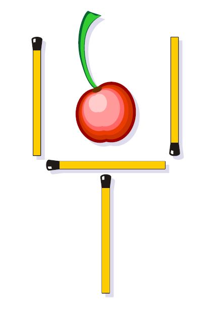
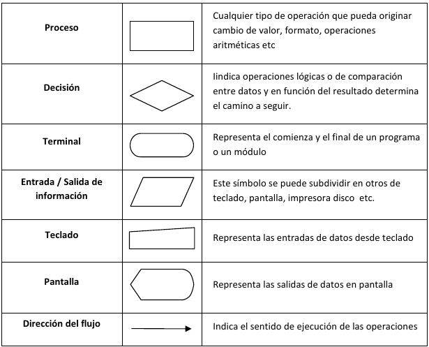
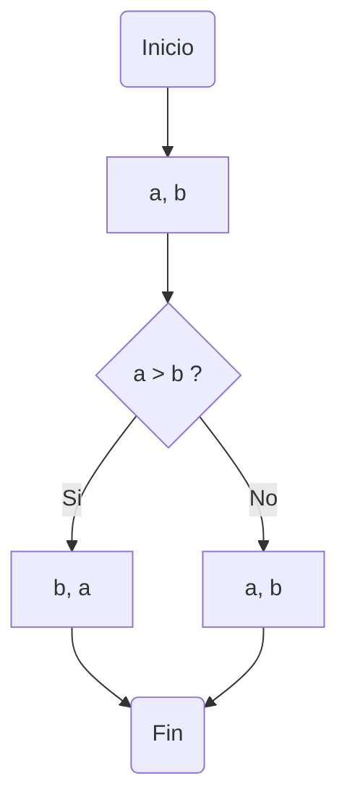
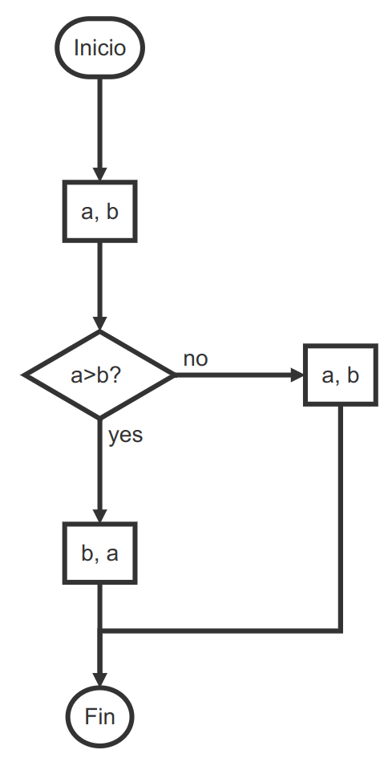
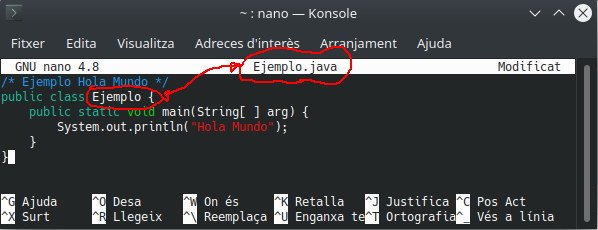

# Elementos de un programa informático

<p><iframe src="https://www.youtube.com/embed/FzjCHnzx7lQ" title="YouTube video player" allow="accelerometer; autoplay; clipboard-write; encrypted-media; gyroscope; picture-in-picture" allowfullscreen="" width="100%" height="315" frameborder="0"></iframe></p>


!!! info "Al finalizar esta unidad serás capaz de..."
    - [ ] Identificar los elementos fundamentales de un programa informático
    - [ ] Definir qué es un problema, un algoritmo y un programa
    - [ ] Conocer la historia y características del lenguaje Java
    - [ ] Declarar variables y constantes utilizando los tipos de datos adecuados
    - [ ] Utilizar operadores aritméticos, relacionales y lógicos
    - [ ] Realizar conversiones de tipo (implícitas y explícitas)
    - [ ] Compilar y ejecutar un programa Java desde la consola

## Piensa como un programador

Una de las acepciones que trae el Diccionario de Real Academia de la Lengua Española (RAE) respecto a la palabra Problema es **“Planteamiento de una situación cuya respuesta desconocida debe obtenerse a través de métodos científicos”**. Con miras a lograr esa respuesta.

!!! info "Definición"
    Un problema es una situación en la cual se trata de alcanzar una meta y para lograrlo se deben hallar y utilizar unos medios y unas estrategias.

La mayoría de problemas tienen algunos elementos en común: un estado inicial; una meta, lo que se pretende lograr; un conjunto de recursos, lo que está permitido hacer y/o utilizar; y un dominio, el estado actual de conocimientos, habilidades y energía de quien va a resolverlo (Moursund, 1999).

Casi todos los problemas requieren, que quien los resuelve, los divida en submetas que, cuando son dominadas (por lo regular en orden), llevan a alcanzar el objetivo. La solución de problemas también requiere que se realicen operaciones durante el estado inicial y las submetas, actividades (conductuales, cognoscitivas) que alteran la naturaleza de tales estados (Schunk, 1997).

Cada disciplina dispone de estrategias específicas para resolver problemas de su ámbito; por ejemplo, resolver problemas matemáticos implica utilizar estrategias propias de las matemáticas. Sin embargo, algunos psicólogos opinan que es posible utilizar con éxito estrategias generales, útiles para resolver problemas en muchas áreas. A través del tiempo, la humanidad ha utilizado diversas estrategias generales para resolver problemas. Schunk (1997), Woolfolk (1999) y otros, destacan los siguientes métodos o estrategias de tipo general:

- **Ensayo y error** : Consiste en actuar hasta que algo funcione. Puede tomar mucho tiempo y no es seguro que se llegue a una solución. Es una estrategia apropiada cuando las soluciones posibles son pocas y se pueden probar todas, empezando por la que ofrece mayor probabilidad de resolver el problema.

  Por ejemplo, una bombilla que no prende: revisar la bombilla, verificar la corriente eléctrica, verificar el interruptor.

- **Iluminación** : Implica la súbita conciencia de una solución que sea viable. Es muy utilizado el modelo de cuatro pasos formulado por Wallas (1921): preparación, incubación, iluminación y verificación.

  Estos cuatro momentos también se conocen como proceso creativo. **Algunas investigaciones han determinado que cuando en el periodo de incubación se incluye una interrupción en el trabajo sobre un problema se logran mejores resultados desde el punto de vista de la creatividad**. La incubación ayuda a "olvidar" falsas pistas, mientras que no hacer interrupciones o descansos puede hacer que la persona que trata de encontrar una solución creativa se estanque en estrategias inapropiadas.

  Ejemplos: 

  - Dispones de 6 lapices/palillos/cerillas igual de largos, ¿como puedes formar 4 triángulos iguales y equiláteros?

  - Mueve 2 cerillas para seguir teniendo una copa pero con la cereza fuera:

    

- **Heurística** : Se basa en la utilización de reglas empíricas para llegar a una solución. El método heurístico conocido como “IDEAL”, formulado por Bransford y Stein (1984), incluye cinco pasos:
  Identificar el problema; definir y presentar el problema; explorar las estrategias viables; avanzar en las estrategias; y lograr la solución y volver para evaluar los efectos de las actividades (Bransford & Stein, 1984). 
  
  El matemático Polya (1957) también formuló un método heurístico para resolver problemas que se aproxima mucho al ciclo utilizado para programar computadores. A lo largo de esta Guía se utilizará este método propuesto por Polya.
  
- **Algoritmos** : Consiste en aplicar adecuadamente una serie de pasos detallados que aseguran una solución correcta. Por lo general, cada algoritmo es específico de un dominio del conocimiento. La programación de computadores se apoya en este método.
  
- **Modelo de procesamiento de información** : El modelo propuesto por Newell y Simon (1972) se basa en plantear varios momentos para un problema (estado inicial, estado final y vías de solución). Las posibles soluciones avanzan por subtemas y requieren que se realicen operaciones en cada uno de ellos.

- **Análisis de medios y fines** : Se funda en la comparación del estado inicial con la meta que se pretende alcanzar para identificar las diferencias. 

  Luego se establecen submetas y se aplican las operaciones necesarias para alcanzar cada submeta hasta que se alcance la meta global. Con este método se puede proceder en retrospectiva (desde la meta hacia el estado inicial) o en prospectiva (desde el estado inicial hacia la meta).
  
- **Razonamiento analógico** : Se apoya en el establecimiento de una analogía entre una situación que resulte familiar y la situación problema. Requiere conocimientos suficientes de ambas situaciones.

- **Lluvia de ideas** : Consiste en formular soluciones viables a un problema. El modelo propuesto por Mayer (1992) plantea: definir el problema; generar muchas soluciones (sin evaluarlas); decidir los criterios para estimar las soluciones generadas; y emplear esos criterios para seleccionar la mejor solución. Requiere que los estudiantes no emitan juicios con respecto a las posibles soluciones hasta que terminen de formularlas.
  
- **Sistemas de producción** : Se basa en la aplicación de una red de secuencias de condición y acción (Anderson, 1990). 
  
- **Pensamiento lateral** : Se apoya en el pensamiento creativo, formulado por Edwar de Bono (1970), el cual difiere completamente del pensamiento lineal (lógico). El pensamiento lateral requiere que se exploren y consideren la mayor cantidad posible de alternativas para solucionar un problema. Su importancia para la educación radica en permitir que el estudiante: explore (escuche y acepte puntos de vista diferentes, busque alternativas); avive (promueva el uso de la fantasía y del humor); libere (use la discontinuidad y escape de ideas preestablecidas); y contrarreste la rigidez (vea las cosas desde diferentes ángulos y evite dogmatismos). Este es un método adecuado cuando el problema que se desea resolver no requiere información adicional, sino un reordenamiento de la información disponible; cuando hay ausencia del problema y es necesario apercibirse de que hay un problema; o cuando se debe reconocer la posibilidad de perfeccionamiento y redefinir esa posibilidad como un problema (De Bono, 1970).

  Ejemplos:

  - **El dilema del náufrago.** Un náufrago necesita trasladar a su isla de residencia algunos restos del naufragio de su barco, que afloraron en la orilla de la isla de enfrente. Allí tiene un zorro, un conejo y un racimo de zanahorias, que en su bote puede llevar a razón de uno por viaje. ¿Cómo puede llevarlo todo a su isla, sin que el zorro se coma al conejo, ni éste a las zanahorias?

    **Respuesta**: Deberá llevar primero al conejo y dejar al zorro con las zanahorias. Luego volver y llevarse al zorro, que dejará a solas en su isla, tomar al conejo y llevarlo de vuelta a la de enfrente. Después llevará las zanahorias, dejando al conejo solo y depositándolas junto al zorro. Finalmente regresará para hacer un último viaje con el conejo.
  
  - **El dilema del ascensor.** Un hombre que vive en el décimo piso de un edificio, toma todos los días el ascensor hasta la planta baja, para ir a trabajar. En la tarde, sin embargo, toma de nuevo el mismo ascensor, pero si no hay nadie con él, baja en el séptimo piso y sube el resto de los pisos por la escalera. ¿Por qué?
  
    **Respuesta**: El hombre es bajito y no logra presionar el botón del décimo piso.
  
  - **La paradoja del globo.** ¿De qué manera podemos pinchar un globo con una aguja, sin que se fugue el aire y sin que el globo estalle?

    **Respuesta**: Debemos pinchar el globo estando desinflado.
  
  - **El dilema del bar.** Un hombre entra a un bar y le pide al barman un vaso de agua. El barman busca debajo de la barra y de golpe apunta al hombre con un arma. Este último da las gracias y se marcha. ¿Qué acaba de ocurrir?
  
    **Respuesta**: El barman se percató de que el hombre tenía hipo, y decide curárselo dándole un buen susto.

!!! info "Resumen"
    Existen muchas estrategias de resolución de problemas, pero esta Guía se enfoca principalmente en dos: **Heurística** (basada en reglas empíricas) y **Algorítmica** (pasos detallados que aseguran una solución correcta).

Según Polya (1957), cuando se resuelven problemas, intervienen cuatro operaciones mentales:

1. Entender el problema;
2. Trazar un plan;
3. Ejecutar el plan (resolver);
4. Revisar;

Es importante notar que estas son flexibles y no una simple lista de pasos como a menudo se plantea en muchos de esos textos (Wilson, Fernández & Hadaway, 1993). Cuando estas etapas se siguen como un modelo lineal, resulta contraproducente para cualquier actividad encaminada a resolver problemas.

Es necesario hacer énfasis en la naturaleza dinámica y cíclica de la solución de problemas. En el intento de trazar un plan, los estudiantes pueden concluir que necesitan entender mejor el problema y deben regresar a la etapa anterior; O cuando han trazado un plan y tratan de ejecutarlo, no encuentran cómo hacerlo; entonces, la actividad siguiente puede ser intentar con un nuevo plan o regresar y desarrollar una nueva comprensión del problema (Wilson, Fernández & Hadaway, 1993; Guzdial, 2000).

!!! tip "Recuerda"
    Las cuatro fases de Polya (Entender, Planificar, Ejecutar, Revisar) son dinámicas y cíclicas, no una simple lista lineal de pasos. Su aplicación a la programación es directa: Analizar, Diseñar el algoritmo, Traducir a código, Depurar.

!!! info "Referencia"
    La mayoría de los textos escolares de matemáticas abordan la Solución de Problemas bajo el enfoque planteado por Polya.

!!! warning "Importante"
    Las fases de la programación son una traducción directa del método de Polya:

    | Polya | Programación |
    |---|---|
    | Entender el problema | Analizar el problema |
    | Trazar un plan | Diseñar un algoritmo |
    | Ejecutar el plan | Traducir a lenguaje de programación |
    | Revisar | Depurar el programa |

Como se puede apreciar, hay una similitud entre las metodologías propuestas para solucionar problemas matemáticos (Clements & Meredith, 1992; Díaz, 1993; Melo, 2001; NAP, 2004) y las cuatro fases para solucionar problemas específicos de áreas diversas, mediante la programación de computadores.

!!! tip "Actividad"
    **Problema de la Jirafa**

    **Primera pregunta:** ¿Cómo podríamos meter una jirafa dentro de una nevera? Piensa que es un problema para niños y a ellos no se les pasaría por la cabeza trocear al bello animal para resolver un problema.
    
    **Segunda pregunta:** Repetimos la jugada con distinto protagonista. ¿Cómo metemos un elefante dentro de la nevera?
    
    **Tercera pregunta:** Imaginemos que el Rey León está celebrando su cumpleaños y ha invitado a todos los animales del reino. Acuden todos excepto uno. ¿Quién falta?
    
    **Cuarta pregunta:** Estamos frente a un río que debemos cruzar como sea para continuar nuestro camino. El único problema es que esa zona es el hogar de unos cocodrilos muy agresivos y no disponemos de ningún tipo de embarcación para ir al otro lado. ¿Cómo harías para cruzar el río sin morir en el intento?

## Problemas, algoritmos y programas

### Problemas

!!! info "Definición"
    La **programación** es una forma de resolución de problemas mediante una secuencia de instrucciones que pueden ejecutarse de forma automática en un ordenador.

Para que un problema pueda resolverse utilizando un programa informático, éste tiene que poder resolverse de forma mecánica, es decir, mediante una secuencia de instrucciones u operaciones que se puedan llevar a cabo de manera **automática** por un ordenador.

Ejemplos de problemas resolubles mediante un ordenador:

- Determinar el producto de dos números a y b.
- Determinar la raíz cuadrada positiva del número 2.
- Determinar la raíz cuadrada positiva de un número n cualquiera.
- Determinar si el número n, entero mayor que uno, es primo.
- Dada la lista de palabras, determinar las palabras repetidas.
- Determinar si la palabra p es del idioma castellano.
- Ordenar y listar alfabéticamente todas las palabras del castellano.
- Dibujar en pantalla un círculo de radio r.
- Separar las silabas de una palabra p.
- A partir de la fotografía de un vehículo, reconocer y leer su matrícula.
- Traducir un texto de castellano a inglés.
- Detectar posibles tumores a partir de imágenes radiográficas.

Por otra parte, el científico Alan Turing, demostró que existen problemas irresolubles, de los que ningún ordenador será capaz de obtener nunca su solución.

!!! danger "Atención"
    Los problemas deben definirse de forma **general** y **precisa**, evitando ambigüedades. Una definición ambigua conduce a interpretaciones distintas y, por tanto, a soluciones incorrectas.

Ejemplo: Raíz cuadrada.

- Determinar la raíz cuadrada de un número n.
- Determinar la raíz cuadrada de un número n, entero no negativo, cualquiera.

Ejemplo: Dividir.

- Calcular la división de dos números de dos números a y b.
- Calcular el cociente entero de la división a/b, donde a y b son números enteros y b es
  distinto de cero. (5/2 = 2).
- Calcular el cociente real de la división a/b, donde a y b son números reales y b es
  distinto de cero (5/2 = 2.5).

### Algoritmos

!!! info "Definición"
    Dado un problema P, un **algoritmo** es un conjunto de reglas o pasos que indican cómo resolver P en un tiempo finito. Es independiente del lenguaje de programación y del dispositivo donde se ejecute.

!!! example "Ejemplo"
    Secuencias de reglas básicas que utilizamos para realizar operaciones aritméticas: sumas, restas, productos y divisiones.

Algoritmo para desayunar

```pseudocode
Begin
	Sentarse
	Servirse café con leche
	Servirse azucar
	If tengo tiempo
		While tenga apetito
			Untar mantequilla en una tostada
			Añadir mermelada
			Comer la tostada
		End While
	End If
	Beberse el café con leche
	Levantarse
End
```

Un algoritmo, por tanto, no es más que la secuencia de pasos que se deben seguir para solucionar un problema específico. La descripción o nivel de detalle de la solución de un problema en términos algorítmicos depende de qué o quién debe entenderlo, interpretarlo y resolverlo.

Los algoritmos son independientes de los lenguajes de programación y de las computadoras donde se ejecutan. Un mismo algoritmo puede ser expresado en diferentes lenguajes de programación y podría ser ejecutado en diferentes dispositivos. Piensa en una receta de cocina, ésta puede ser expresada en castellano, inglés o francés, podría ser cocinada en fogón o vitrocerámica, por un cocinero o más, etc. Pero independientemente de todas estas circunstancias, el plato se preparará siguiendo los mismos pasos.

!!! warning "Importante"
    La diferencia fundamental entre **algoritmo** y **programa**: el algoritmo describe los pasos para resolver un problema (independiente del lenguaje), mientras que el programa es la implementación concreta de ese algoritmo en un lenguaje de programación específico para ser ejecutado en un ordenador.

#### Características de los algoritmos

!!! danger "Atención"
    Un algoritmo debe cumplir cuatro características para ser válido:

    - **Generalidad**: debe resolver toda una clase de problemas, no uno aislado.
    - **Finitud**: debe acabar necesariamente tras un número finito de pasos.
    - **Definibilidad**: debe estar definido de forma exacta y precisa, sin ambigüedades.
    - **Eficiencia**: debe resolver el problema de forma rápida y eficiente.

!!! info "Vídeo"
    Juego de las monedas (Eduardo Sáenz Cabezón)

    [](https://youtu.be/BbA5dpS4CcI?si=5vftn3igSxoPCzqb&t=1610)
    
    *Desde el comienzo del enlace hasta 7 minutos después.*


#### Representación de algoritmos

Los métodos más usuales para representar algoritmos son los diagramas de flujo y el pseudocódigo. Ambos son sistemas de representación independientes de cualquier lenguaje de programación. Hay que tener en cuenta que el diseño de un algoritmo constituye un paso previo a la codificación de un programa en un lenguaje de programación determinado (C, C++, Java, Pascal). La independencia del algoritmo del lenguaje de programación facilita, precisamente, la posterior codificación en el lenguaje elegido.

!!! info "Definición"
    Un **diagrama de flujo** es una representación gráfica de un algoritmo mediante símbolos estándar (inicio/fin, proceso, decisión, entrada/salida) unidos por flechas que indican el orden de ejecución.

Los símbolos más utilizados son:



Ejemplo: Mostrar dos números ordenados de menor a mayor.


O también en otra representación:

{width=300}

!!! info "Definición"
    El **pseudocódigo** es un lenguaje informal de descripción de algoritmos, cercano a la sintaxis de los lenguajes de programación, que NO puede ejecutarse en un ordenador. Debe traducirse (codificarse) a un lenguaje real.

El pseudocódigo no se puede ejecutar nunca en el ordenador, sino que tiene que traducirse a un lenguaje de programación (codificación). La ventaja del pseudocódigo, frente a los diagramas de flujo, es que se puede modificar más fácilmente si detecta un error en la lógica del algoritmo, y puede ser traducido fácilmente a los lenguajes estructurados como Pascal, C, fortran, Java, etc.

El Pseudocódigo utiliza palabras reservadas (en sus orígenes se escribían en inglés) para representar las sucesivas acciones. Para mayor legibilidad utiliza la **identación** (sangría en el margen izquierdo) de sus líneas.

Ejemplo: Mostrar dos números ordenados de menor a mayor.

```pseudocode
Begin
	Leer (A, B)
	If (A>B) then
		Escribir (B, A)
	Else
		Escribir (A, B)
	End If
End
```

### Programas


Los lenguajes de programación son sólo un medio para expresar el algoritmo y el ordenador un procesador para ejecutarlo. El diseño de los algoritmos será una tarea que necesitará de la creatividad y conocimientos de las técnicas de programación. Estilos distintos, de distintos programadores a la hora de obtener la solución del problema, darán lugar a programas diferentes, igualmente válidos.

Pero cuando los problemas son complejos, es necesario descomponer éstos en subproblemas más simples y, a su vez, en otros más pequeños. Estas estrategias reciben el nombre de diseño descendente (Metodología de diseño de programas, consistente en la descomposición del problema en problemas más sencillos de resolver) o diseño modular (top‐down design) (Metodología de diseño de programas, que consiste en dividir la solución a un problema en módulos más pequeños o subprogramas. Las soluciones de los módulos se unirán para obtener la solución general del problema). Este sistema se basa en el lema **divide y vencerás**.

!!! tip "Recuerda"
    El **diseño descendente** (divide y vencerás) es una de las estrategias más importantes en programación: descomponer un problema complejo en subproblemas más simples, y estos a su vez en otros más pequeños, hasta que cada pieza sea fácil de resolver.

## Java

### ¿Qué y cómo es Java?

Java es un lenguaje sencillo de aprender, con una sintaxis parecida a la de C++, pero en la que se han eliminado elementos complicados y que pueden originar errores. Java es orientado a objetos, con lo que elimina muchas preocupaciones al programador y permite la utilización de gran cantidad de bibliotecas ya definidas, evitando reescribir código que ya existe. Es un lenguaje de programación creado para satisfacer nuevas necesidades que los lenguajes existentes hasta el momento no eran capaces de solventar.

!!! info "Información"
    La principal virtud de Java es su **independencia de plataforma**: el código se compila a *bytecode*, que se ejecuta sobre la Máquina Virtual Java (JVM), permitiendo que un mismo programa funcione en cualquier sistema operativo. Lema: *"Write once, run everywhere"*.

Antes de que apareciera Java, el lenguaje C era uno de los más extendidos por su versatilidad. Pero cuando los programas escritos en C aumentaban de volumen, su manejo comenzaba a complicarse.
Mediante las técnicas de programación estructurada y programación modular se conseguían reducir estas complicaciones, pero no era suficiente.

Fue entonces cuando la Programación Orientada a Objetos (POO) entra en escena, aproximando notablemente la construcción de programas al pensamiento humano y haciendo más sencillo todo el proceso. Los problemas se dividen en objetos que tienen propiedades e interactúan con otros objetos, de este modo, el programador puede centrarse en cada objeto para programar internamente los elementos y funciones que lo componen.

!!! info "Resumen"
    Características clave de Java: independiente de plataforma, orientado a objetos, sintaxis similar a C/C++, distribuido (TCP/IP), amplias bibliotecas, robusto (comprobaciones en compilación y ejecución), y seguro.

### Breve historia.

Java surgió en 1991 cuando un grupo de ingenieros de Sun Microsystems trataron de diseñar un nuevo lenguaje de programación destinado a programar pequeños dispositivos electrónicos. La dificultad de estos dispositivos es que cambian continuamente y para que un programa funcione en el siguiente dispositivo aparecido, hay que reescribir el código. Por eso la empresa Sun quería crear un lenguaje independiente del dispositivo.

Pero no fue hasta 1995 cuando pasó a llamarse Java, dándose a conocer al público como lenguaje de programación para computadores. Java pasa a ser un lenguaje totalmente independiente de la plataforma y a la vez potente y orientado a objetos. Esa filosofía y su facilidad para crear aplicaciones para redes TCP/IP ha hecho que sea uno de los lenguajes más utilizados en la actualidad.

El factor determinante para su expansión fue la incorporación de un intérprete Java en la versión 2.0 del navegador Web Netscape Navigator, lo que supuso una gran revuelo en Internet. A principios de 1997 apareció Java 1.1 que proporcionó sustanciales mejoras al lenguaje. Java 1.2, más tarde rebautizado como Java 2, nació a finales de 1998.

El principal objetivo del lenguaje Java es llegar a ser el nexo universal que conecte a los usuarios con la información, esté ésta situada en el ordenador local, en un servidor Web, en una base de datos o en cualquier otro lugar.

Para el desarrollo de programas en lenguaje Java es necesario utilizar un entorno de desarrollo denominado JDK (Java Development Kit), que provee de un compilador y un entorno de ejecución (JRE – Java RunEnvironment) para los bytecodes generados a partir del código fuente. Al igual que las diferentes versiones del lenguaje han incorporado mejoras, el entorno de desarrollo y ejecución también ha sido mejorado sucesivamente.

Java 2 es la tercera versión del lenguaje, pero es algo más que un lenguaje de programación, incluye los siguientes elementos:

- Un lenguaje de programación: Java.
- Un conjunto de bibliotecas estándar que vienen incluidas en la plataforma y que son necesarias en todo entorno Java. Es el Java Core.
- Un conjunto de herramientas para el desarrollo de programas, como es el compilador de bytecodes, el generador de documentación, un depurador, etc.
- Un entorno de ejecución que en definitiva es una máquina virtual que ejecuta los programas traducidos a bytecodes.

### Compilar y ejecutar un programa `Java`. Uso de la consola.

Veamos los pasos para compilar e interpretar nuestro primer programa escrito en lenguaje Java.

#### Estructura y bloques fundamentales de un programa.

!!! example "Ejemplo Holamundo.java"
    Consulta el [Ejemplo01 — Hola Mundo](#ejemplo01) para ver el código completo.
    {: #teoria-ejemplo01 }

!!! danger "Atención"
    En Java, el nombre del archivo `.java` debe coincidir **exactamente** con el nombre de la clase pública que contiene (respetando mayúsculas y minúsculas). Por ejemplo: la clase `public class Ejemplo` debe guardarse en `Ejemplo.java`.

```java
public class Holamundo {
	[...]
}
```

El código java en las clases se agrupa en funciones o métodos. Cuando java ejecuta el código de una clase busca la función o método `main()` para ejecutarla. Es público (`public`) estático (`static`) para llamarlo sin instanciar la clase. No devuelve ningún valor (`void`) y admite parámetros (`Strings[] args`) que en este caso no se han utilizado.

```java
[...]
	public static void main (String[] args)
	{
		[...]
	}
[...]
```

El código de la función `main` se escribe entre las llaves. Por ejemplo:

```java
[...]
		System.out.println("Hola Mundo");
[...]
```

Muestra por pantalla el mensaje `Hola Mundo`, ya que la clase `System` tiene un atributo `out` con dos métodos: `print()` y `println()`. La diferencia es que `println` muestra mensaje e introduce un retorno de carro.

!!! warning "Importante"
    En Java, toda instrucción debe terminar con punto y coma (`;`). Las únicas excepciones son las llaves de apertura `{` y cierre `}`.

#### Sangrado o tabulado

!!! tip "Recomendación"
    Aplica sangrado (indentación) consistente de 2-4 espacios en cada nivel lógico. Para principiantes se recomiendan 4 espacios. No mezcles tabuladores con espacios; elige uno y sé consistente.

!!! tip "Recomendación"
    Limita las líneas de código a 70-90 caracteres. Si una línea es más larga, divídela:
    - Tras una coma
    - Antes de un operador (que pasará a la línea siguiente)
    - En una construcción de alto nivel (paréntesis)
    - La línea continuada debe alinearse con un sangrado lógico adicional

Unos pocos ejemplos, para comprender mejor:

Unos pocos ejemplos, para comprender mejor:

Dividir tras una coma:

```java
funcion(expresionMuuuuyLarga1,
         expresionMuuuyyyyLarga2, 
         expresionMuuuyyyLarga3);
```

Mantener la expresión entre paréntesis en la misma línea:

```java
nombreLargo = nombreLargo2*
              (nombreLargo3 + nombreLArgo4)+
              4*nombreLargo5;
```

Siempre hay excepciones. Puede resultar que al aplicar estas reglas, en operaciones muy largas, o expresiones lógicas enormes, el sangrado sea ilegible. En estos casos, el convenio se puede relajar.

#### PASO 1: Creación del código fuente

Abrimos un editor de texto (da igual cual sea, siempre que sea capaz de almacenar "texto sin formato" en código ASCII). Una vez abierto escribiremos nuestro primer programa, que mostrará un texto "Hola Mundo" en la consola. De momento no te preocupes si no entiendes lo que escribes, más adelante le daremos sentido. Ahora solo queremos ver si podemos ejecutar java en nuestro equipo.

El código de nuestro programa en Java será el siguiente (consulta el [Ejemplo02 — Compilación y ejecución](#ejemplo02) para ver el ciclo completo):
{: #teoria-ejemplo02 }

A continuación guardamos nuestro archivo y le ponemos como nombre `Ejemplo.java`. Debemos seguir una norma dictada por Java, hemos de hacer coincidir nombre del archivo y nombre del programa, tanto en mayúsculas como en minúsculas, y la extensión del archivo habrá de ser siempre `.java`.



Debemos recordar exactamente la ruta donde guardamos el archivo de ejemplo `Ejemplo.java`.

#### PASO 2: Compilación del programa

Vamos a proceder a compilar e interpretar este pequeño programa Java (no te preocupes si todavía no entiendes el significado de las palabras compilar e interpretar, lo veras en la asignatura de `Entornos de Desarrollo`). Para ello usaremos la consola. Una vez en la consola debemos colocarnos en la ruta donde previamente guardamos el archivo `Ejemplo.java`.

A continuación daremos la instrucción para que se realice **el proceso de compilación del programa**, para lo que escribiremos `javac Ejemplo.java`, donde `javac` es el nombre del compilador (`java c`ompiler) que transformará el programa que hemos escrito nosotros en lenguaje Java al lenguaje de la máquina virtual Java (`bytecode`), dando como resultado un nuevo archivo `Ejemplo.class` que se creará en este mismo directorio. Comprueba que no aparezca ningún error y que `javac` esté instalado en tu sistema (desde la consola lo puedes comprobar con el comando `javac --version` y debería aparece el número de versión que tienes instalada). Si aparecen los dos archivos tanto `Ejemplo.java` (código fuente) como `Ejemplo.class` (bytecode creado por el compilador) puedes continuar.

!!! tip "Recuerda"
    El proceso de compilación (`javac`) transforma código fuente `.java` en bytecode `.class`. El proceso de ejecución (`java`) interpreta el bytecode en la JVM. Dos pasos separados: primero compilar, luego ejecutar.

#### PASO 3: Ejecución del programa

Finalmente, vamos a pedirle al intérprete (JVM) que ejecute el programa, es decir, que transforme el código de la máquina virtual Java en código máquina interpretable por nuestro ordenador y lo ejecute. Para ello escribiremos en la ventana consola: `java Ejemplo`.

El resultado será que se nos muestra la cadena `Hola Mundo`. Si logramos visualizar este texto en pantalla, ya hemos desarrollado nuestro primer programa en Java.

!!! question "Pregunta frecuente"
    ¿Por qué no necesito compilar mi archivo `.java` antes de ejecutarlo y funciona directamente si me salto ese paso?

    https://stackoverflow.com/questions/54493058/running-a-java-program-without-compiling

## Componentes del lenguaje Java

### Variables, identificadores, convenciones.

#### Variables

!!! info "Definición"
    Una **variable** es una posición de memoria identificada por un nombre, con un tipo de dato que determina qué clase de información puede almacenar y qué rango de valores admite.

Las variables vienen determinadas por:
- un **nombre**, que permite al programa acceder al valor que contiene en memoria. Debe ser un identificador válido.
- un **tipo de dato**, que especifica qué clase de información guarda la variable en esa zona de memoria
- un **rango de valores** que puede admitir dicha variable.

Las variables declaradas dentro de un bloque `{ }` son accesibles solo dentro de ese bloque. Una variable local no puede ser declarada como `static`. Una variable no puede declararse fuera de la clase.

!!! warning "Importante"
    El ámbito (scope) de una variable es la zona del código donde es accesible. Las variables declaradas dentro de un bloque `{ }` solo existen y son visibles dentro de ese bloque. Fuera de él, no están disponibles.

Al nombre que le damos a la variable se le llama identificador. Los identificadores permiten nombrar los elementos que se están manejando en un programa. Vamos a ver con más detalle ciertos aspectos sobre los identificadores que debemos tener en cuenta.

#### Identificadores

!!! info "Definición"
    Un **identificador** es un nombre que damos a variables, clases, métodos, etc. Debe empezar por letra, `_` o `$`, y puede contener letras, dígitos, `_` y `$` (sin espacios). Java distingue mayúsculas de minúsculas. Por ejemplo, son válidos los siguientes identificadores:

    - x5
    - ατη
    - NUM_MAX
    - numCuenta

Unicode es un código de caracteres o sistema de codificación, un alfabeto que recoge los caracteres de prácticamente todos los idiomas importantes del mundo. Además, el código Unicode es “compatible” con el código ASCII, ya que para los caracteres del código ASCII, Unicode asigna como código los mismos 8 bits, a los que les añade a la izquierda otros 8 bits todos a cero. La conversión de un carácter ASCII a Unicode es inmediata.

#### Convenciones

**Normas de estilo para nombrar variables**

!!! tip "Recomendación"
    Sigue siempre las convenciones de nombres en Java:
    
    - **Variables y métodos:** `lowerCamelCase` (ej. `numAlumnos`, `obtieneValor`)
    - **Constantes:** `MAYÚSCULAS_CON_GUIONES` (ej. `TAM_MAX`, `PI`)
    - **Clases:** `UpperCamelCase` (ej. `MiClase`, `String`)
    
    Esto hace tu código más legible y profesional.

| Identificador       | Convención                                                   | Ejemplo                     |
| ------------------- | ------------------------------------------------------------ | --------------------------- |
| nombre de variable  | Comienza por letra minúscula, y si tienen más de una palabra se colocan juntas y el resto comenzando por mayúsculas. A esto se le llama *lowerCamelCase*. | numAlumnos, suma            |
| nombre de constante | En letras mayúsculas, separando las palabras con el guión bajo, por convenio el guión bajo no se utiliza en ningún otro sitio | TAM_MAX, PI                 |
| nombre de una clase | Comienza por letra mayúscula, y si tienen más de una palabra se colocan juntas y el resto comenzando por mayúsculas. A esto se le llama *UpperCamelCase*. | String, MiTipo              |
| nombre de función   | Comienza por letra minúscula, y si tienen más de una palabra se colocan juntas y el resto comenzando por mayúsculas. A esto se le llama *lowerCamelCase*. | modificaValor, obtieneValor |

Puedes consultar estas y otras convenciones sobre código Java en este [enlace](https://www.um.es/docencia/vjimenez/ficheros/practicas/ConvencionesCodigoJava.pdf).

**Palabras reservadas**

!!! danger "Atención"
    Las **palabras reservadas** (`class`, `public`, `static`, `void`, `int`, etc.) NO pueden usarse como identificadores (nombres de variables, clases o métodos). Si intentas usarlas, el compilador producirá un error.

Las palabras reservadas en Java son:

```
abstract, continue, for, new, switch, assert, default, goto, package, synchronized, boolean, do, if, private, this, break, double, implements, protected, throw, byte, else, import, public, throws, case, enum, instanceof, return, transient, catch, extends, int, short, try, char, final, interface, static, void, class, finally, long, strictfp, volatile, const, float, native, super, while.
```

### Tipos de datos.

Los tipos de datos se utilizan para declarar variables y el compilador sepa de antemano que tipo de información contendrá la variable.

Java dispone de los siguientes tipos de datos simples:

| **Tipo de dato** | **Representación**                                           | **Tamaño (Bytes)** |                       **Rango de Valores** | **Valor por defecto** | **Clase Asociada** |
| ---------------- | ------------------------------------------------------------ | -----------------: | -----------------------------------------: | --------------------: | ------------------ |
| **byte**         | Numérico Entero con signo                                    |                  1 |                                 -128 a 127 |                     0 | Byte               |
| **short**        | Numérico Entero con signo                                    |                  2 |                             -32768 a 32767 |                     0 | Short              |
| **int**          | Numérico Entero con signo                                    |                  4 |                   -2147483648 a 2147483647 |                     0 | Integer            |
| **long**         | Numérico Entero con signo                                    |                  8 | -9223372036854775808 a 9223372036854775807 |                     0 | Long               |
| **float**        | Numérico en Coma flotante de precisión simple Norma IEEE 754 |                  4 |                  -3.4x10^-38^ a 3.4x10^38^ |                   0.0 | Float              |
| **double**       | Numérico en Coma flotante de precisión doble Norma IEEE 754  |                  8 |               -1.8x10^-308^ a 1.8x10 ^308^ |                   0.0 | Double             |
| **char**         | Carácter Unicode                                             |                  2 |                            \u0000 a \uFFFF |                \u0000 | Character          |
| **boolean**      | Dato lógico                                                  |                  - |                               true ó false |                 false | Boolean            |
| **void**         | -                                                            |                  - |                                          - |                     - | Void               |

!!! info "Referencia"
    Sobre valores por defecto y inicialización de variables: https://stackoverflow.com/questions/19131336/default-values-and-initialization-in-java

Ejemplo de declaración y asignación de valores a variables:

| Tipo de datos | código                                                       |
| ------------: | :----------------------------------------------------------- |
|          byte | `byte a;`                                                    |
|         short | `short b, c=3;`                                              |
|           int | `int d=-30;`<br />`int e=0xC125; //la 0x significa Hexadecimal` |
|          long | `long b=46240;`<br />`long b=5L; // La L en este caso indica Long` |
|          char | `char car1='c';`<br />`char car2=99; //car1 y car2 son iguales, la c equivale al ascii 99`<br />`char letra = '\u0061'; //código unicode del carácter "a"` |
|         float | `float pi=3.1416;`<br />`float pi=3.1416F; //La F significa float`<br />`float medio=1/2; //0.5` |
|        double | `double millon=1e6; // 1x10^6`<br />`double medio=1/2D; //0.5, la D significa double`<br />`double z=.123; //si la parte entera es 0 se puede omitir` |
|       boolean | `boolean esPrimero;`<br />`boolean esPar=false;`             |
!!! warning "Precaución"
    Ojo con los tipo float: https://jvns.ca/blog/2023/01/13/examples-of-floating-point-problems/

### Tipos referenciados

A partir de los ocho tipos datos primitivos, se pueden construir otros tipos de datos. Estos tipos de datos se llaman tipos referenciados o referencias, porque se utilizan para almacenar la dirección de los datos en la memoria del ordenador.

```java
int[] arrayDeEnteros;
Cuenta cuentaCliente;
```

En la primera instrucción declaramos una lista de números del mismo tipo, en este caso, enteros. En la segunda instrucción estamos declarando la variable u objeto `cuentaCliente` como una referencia de tipo `Cuenta`.

Cualquier aplicación de hoy en día necesita no perder de vista una cierta cantidad de datos. Cuando el conjunto de datos utilizado tiene características similares se suelen agrupar en estructuras para facilitar el acceso a los mismos, son los llamados datos estructurados.

Son datos estructurados los `arrays`, `listas`, `árboles`, etc. Pueden estar en la memoria del programa en ejecución, guardados en el disco como ficheros, o almacenados en una base de datos.

!!! warning "Importante"
    `String` en Java es un tipo referenciado (objeto), no un tipo primitivo. Sin embargo, Java le da un tratamiento especial que permite usarlo con una sintaxis simplificada, como si fuera un tipo básico. Lo estudiaremos en profundidad en la siguiente unidad.

```java
String mensaje;
mensaje= "El primer programa";
```

Hemos visto qué son las variables, cómo se declaran y los tipos de datos que pueden adoptar. Anteriormente hemos visto un ejemplo de creación de variables, en esta ocasión vamos a crear más variables, pero de distintos tipos primitivos y los vamos a mostrar por pantalla. Los tipos referenciados los veremos en la siguiente unidad.

Para mostrar por pantalla un mensaje utilizamos `System.out`, conocido como la salida estándar del programa. Este método lo que hace es escribir un conjunto de caracteres a través de la línea de comandos. Podemos utilizar `System.out.print` o `System.out.println`. En el segundo caso lo que hace el método es que justo después de escribir el mensaje, sitúa el cursor al principio de la línea siguiente.

El texto en color gris que aparece entre caracteres // son comentarios que permiten documentar el código, pero no son tenidos en cuenta por el compilador y, por tanto, no afectan a la ejecución del programa.

### Tipos enumerados

!!! info "Definición"
    Un **tipo enumerado** (`enum`) es un tipo de dato definido por el programador que solo puede tomar un conjunto restringido de valores predefinidos. Por ejemplo: `enum Dias {Lunes, Martes, Miercoles, Jueves, Viernes, Sabado, Domingo}`.

Los tipos de datos enumerados son una forma de declarar una variable con un conjunto restringido de valores. Es como si definiéramos nuestro propio tipo de datos.

Al considerar Java este tipo de datos como si de una clase se tratara, no sólo podemos definir los valores de un tipo enumerado, sino que también podemos definir operaciones a realizar con él y otro tipo de elementos, lo que hace que este tipo de dato sea más versátil y potente que en otros lenguajes de programación.

!!! example "Tipos enumerados"
    Consulta el [Ejemplo03 — Tipos enumerados](#ejemplo03) para ver el código completo y su salida.
    {: #teoria-ejemplo03 }

Tenemos una variable `Dias` que almacena los días de la semana. Para acceder a cada elemento del tipo enumerado se utiliza el nombre de la variable seguido de un punto y el valor en la lista. Más tarde veremos que podemos añadir métodos y campos o variables en la declaración del tipo enumerado, ya que como hemos comentado un tipo enumerado en Java tiene el mismo tratamiento que las clases.

En este ejemplo hemos utilizado el método `System.out.print`. Como podrás comprobar si lo ejecutas, la instrucción `print` escribe el texto que tiene entre comillas pero no salta a la siguiente línea, por lo que la instrucción `println` escribe justo a continuación.

Sin embargo, también podemos escribir varias líneas usando una única sentencia. Así lo hacemos en la instrucción `println`, la cual imprime como resultado tres líneas de texto. Para ello hemos utilizado un carácter especial, llamado carácter escape (`\`). Este carácter sirve para darle ciertas órdenes al compilador, en lugar de que salga impreso en pantalla. Después del carácter de escape viene otro carácter que indica la orden a realizar, juntos reciben el nombre de secuencia de escape. La secuencia de escape `\n` recibe el nombre de carácter de nueva línea. Cada vez que el compilador se encuentra en un texto ese carácter, el resultado es que mueve el cursor al principio de la línea siguiente. En el próximo apartado vamos a ver algunas de las secuencias de escape más utilizadas.

### Constantes y literales.

!!! info "Definición"
    Una **constante** es una variable cuyo valor no puede cambiar una vez asignado. En Java se declara con la palabra clave `final`:
    
    ```java
    final double IVA = 0.21;
    ```

Los **literales** pueden ser de tipo simple, null o string, como por ejemplo 230, null o "Java".

Respecto a los literales existen unos caracteres especiales que se representan utilizando secuencias de escape:

| Secuencia de escape | Significado     | Secuencia de escape | Significado               |
| ------------------- | --------------- | ------------------- | ------------------------- |
| \b                  | Retroceso       | \r                  | Retorno de carro          |
| \t                  | Tabulador       | \’’                 | Carácter comillas dobles  |
| \n                  | Salto de línea  | \’                  | Carácter comillas simples |
| \f                  | Salto de página | \\\                 | Barra diagonal            |

### Operadores y expresiones.

#### Operadores Aritméticos

Los **Operadores Aritméticos** permiten realizar operaciones matemáticas:

| Operador | Uso   | Operación                             |
| -------- | ----- | ------------------------------------- |
| +        | A + B | Suma                                  |
| -        | A - B | Resta                                 |
| *        | A * B | Multiplicación                        |
| /        | A / B | División                              |
| %        | A % B | Módulo o resto de una división entera |

!!! example "Operadores aritméticos"
    Consulta el [Ejemplo04 — Operadores aritméticos](#ejemplo04) para ver ejemplos de cada operación.
    {: #teoria-ejemplo04 }

#### Operadores Relacionales

Los **Operadores Relacionales** permiten evaluar (la respuesta es un booleano: si o no) la igualdad de los operandos:

| Operador | Uso      | Operación             |
| -------- | -------- | --------------------- |
| `<`      | `a < b`  | a menor que b         |
| `>`      | `a > b`  | a mayor que b         |
| `<=`     | `a <= b` | a menor o igual que b |
| `>=`     | `a >= b` | a mayor o igual que b |
| `!=`     | `a != b` | a distinto de b       |
| `==`     | `a == b` | a igual a b           |

!!! example "Operadores relacionales"
    Consulta el [Ejemplo05 — Operadores relacionales](#ejemplo05) para ver ejemplos de cada operador.
    {: #teoria-ejemplo05 }

#### Operadores Lógicos

Los **Operadores Lógicos** permiten realizar operaciones lógicas:

| Operador   | Uso                 | Operación                                                    |
| ---------- | ------------------- | ------------------------------------------------------------ |
| `&&` o `&` | `a&&b` o<br />`a&b` | a **AND** b. El resultado será *true* si ambos operadores son *true* y *false* en caso contrario. |
| `||` o `|` | `a||b` o<br />`a|b` | a **OR** b. El resultado será *false* si ambos operandos son *false* y *true* en caso contrario |
| `!`        | `!a`                | **NOT** a. Si el operando es *true* el resultado es *false* y si el operando es *false* el resultado es *true*. |
| `^`        | `a^b`               | a **XOR** b. El resultado será *true* si un operando es *true* y el otro *false*, y *false* en caso contrario. |

!!! example "Operadores lógicos"
    Consulta el [Ejemplo06 — Operadores lógicos](#ejemplo06) para ver ejemplos con AND, OR, NOT y XOR.
    {: #teoria-ejemplo06 }

Para representar resultados de operadores Lógicos también se pueden usar tablas de verdad a las que conviene acostumbrarse:

|   `a`   |   `b`   | `a && b` | `a || b` |  `!a`   |  `a^b`  |
| :-----: | :-----: | :------: | :------: | :-----: | :-----: |
| `false` | `false` | `false`  | `false`  | `true`  | `false` |
| `true`  | `false` | `false`  |  `true`  | `false` | `true`  |
| `false` | `true`  | `false`  |  `true`  | `true`  | `true`  |
| `true`  | `true`  |  `true`  |  `true`  | `false` | `false` |

#### Operadores Unarios o Unitarios

Los **Operadores Unarios** o **Unitarios** permiten realizar incrementos y decrementos:

| Operador | Uso           | Operación       |
| -------- | ------------- | --------------- |
| `++`     | `a++` o `++a` | Incremento de a |
| `--`     | `a--` o `--a` | Decremento de a |

!!! example "Operadores unarios"
    Consulta el [Ejemplo07 — Operadores unarios](#ejemplo07) para ver la diferencia entre prefijo y sufijo.
    {: #teoria-ejemplo07 }

#### Operadores de Asignación

Los **Operadores de Asignación** permiten asignar valores:

| Operador | Uso      | Operación                                                    |
| -------- | -------- | ------------------------------------------------------------ |
| `=`      | `a = b`  | Asignación (como ya hemos visto)                             |
| `*=`     | `a *= b` | Multiplicación y asignación. La operación `a*=b` equivale a `a=a*b` |
| `/=`     | `a /= b` | División y asignación. La operación `a/=b` equivale a `a=a/b` |
| `%=`     | `a %= b` | Módulo y asignación. La operación `a%=b` equivale a `a=a%b`  |
| `+=`     | `a += b` | Suma y asignación. La operación `a+=b` equivale a `a=a+b`    |
| `-=`     | `a -= b` | Resta y asignación. La operación `a-=b` equivale a `a=a-b` |

!!! example "Operadores de asignación"
    Consulta el [Ejemplo08 — Operadores de asignación](#ejemplo08) para ver ejemplos.
    {: #teoria-ejemplo08 }

#### Operadores de desplazamiento

Los **Operadores de desplazamiento** permiten desplazar los bits de los valores:

| Operador | Utilización | Resultado                                                    |
| -------- | ----------- | ------------------------------------------------------------ |
| `<<`     | `a << b`    | Desplazamiento de `a` a la izquierda en `b` posiciones. Multiplica por 2 el número b de veces. |
| `>>`     | `a >> b`    | Desplazamiento de `a` a la derecha en `b` posiciones, tiene en cuenta el signo. Divide por 2 el número `b` de veces. |
| `>>>`    | `a >>> b`   | Desplazamiento de a a la derecha en b posiciones, no tiene en cuenta el signo. (simplemente agrega ceros por la izquierda) |
| `&`      | `a & b`     | Operación AND a nivel de bits                                |
| `|`      | `a | b`     | Operación OR a nivel de bits                                 |
| `^`      | `a^b`       | Operación XOR a nivel de bits                                |
| `~`      | `~a`        | Complemento de A a nivel de bits                             |

!!! example "Operadores de desplazamiento"
    Consulta el [Ejemplo09 — Operadores de desplazamiento](#ejemplo09) para ver ejemplos detallados con bits.
    {: #teoria-ejemplo09 }

#### Operador condicional o ternario `?:`

El **operador condicional** `?:` sirve para evaluar una condición y devolver un resultado en función de si es verdadera o falsa dicha condición. Es el único operador ternario de Java, y como tal, necesita tres operandos para formar una expresión.

El primer operando se sitúa a la izquierda del símbolo de interrogación, y siempre será una expresión booleana, también llamada **condición**. El siguiente operando se sitúa a la derecha del símbolo de interrogación y antes de los dos puntos, y es el **valor** que devolverá el operador condicional **si la condición es verdadera**. El último operando, que aparece después de los dos puntos, es la expresión cuyo **resultado se devolverá si la condición evaluada es falsa**.

!!! example "Operador ternario"
    Consulta el [Ejemplo10 — Operador ternario](#ejemplo10) para ver cómo funciona el operador `?:`.
    {: #teoria-ejemplo10 }

El operador condicional se puede sustituir por la sentencia `if...then...else` que veremos más adelante.


#### Prevalencia de operadores

Los operadores tienen diferente **Prioridad** por lo que es interesante utilizar paréntesis para controlar las operaciones sin necesidad de depender de la prioridad de los operadores.

Prevalencia de operadores, ordenados de arriba a abajo de más a menos prioridad:

| Descripción               | Operadores                                |
| ------------------------- | ----------------------------------------- |
| operadores posfijos       | `op++` `op--`                             |
| operadores unarios        | `++op --op +op -op ~ !`                   |
| multiplicación y división | `* / %`                                   |
| suma y resta              | `+ -`                                     |
| desplazamiento            | `<< >> >>>`                               |
| operadores relacionales   | `< > <= =>`                               |
| equivalencia              | `== !=`                                   |
| operador AND              | `&`                                       |
| operador XOR              | `^`                                       |
| operador OR               | `|`                                       |
| AND booleano              | `&&`                                      |
| OR booleano               | `||`                                      |
| condicional               | `?:`                                      |
| operadores de asignación  | `= += -= *= /= %= &= ^= \|= <<= >>= >>>=` |

!!! example "Prevalencia de operadores"
    Consulta el [Ejemplo11 — Prevalencia de operadores](#ejemplo11) para ver la diferencia con y sin paréntesis.
    {: #teoria-ejemplo11 }

!!! tip "Recuerda"
    "Los paréntesis son como las patatas fritas, cuantas más, mejor!" — Usa paréntesis para controlar explícitamente el orden de las operaciones y evitar depender de la tabla de precedencia, que es fácil de olvidar.

### Conversiones de tipo.

!!! danger "Atención"
    Las conversiones de tipo pueden provocar **pérdida de información**. Una conversión implícita (automática) solo es segura cuando el tipo destino tiene mayor precisión. Las conversiones explícitas (cast) son forzadas por el programador y deben usarse con cuidado.

#### Conversiones Implícitas

Las **Conversiones Implícitas** se realizan de forma automática y requiere que la variable destino tenga más precisión que la variable origen para poder almacenar el valor.

!!! example "Conversiones de tipo"
    Consulta el [Ejemplo12 — Conversiones de tipo](#ejemplo12) para ver ejemplos de conversión implícita y explícita.
    {: #teoria-ejemplo12 }

### Comentarios.

Los comentarios son muy importantes a la hora de describir qué hace un determinado programa. A lo largo de la unidad los hemos utilizado para documentar los ejemplos y mejorar la comprensión del código. Para lograr ese objetivo, es normal que cada programa comience con unas líneas de comentario que indiquen, al menos, una breve descripción del programa, el autor del mismo y la última fecha en que se ha modificado.

!!! tip "Recomendación"
    Documenta siempre tu código con comentarios. Cada programa debe incluir al menos: breve descripción de lo que hace, autor y fecha de última modificación. Java soporta tres tipos: `//` (una línea), `/* ... */` (multilínea), y `/** ... */` (Javadoc para documentación automática).

Todos los lenguajes de programación disponen de alguna forma de introducir comentarios en el código. En el caso de Java, nos podemos encontrar los siguientes tipos de comentarios:

- Comentarios de **una sola línea**. Utilizaremos el delimitador // para introducir comentarios de sólo una línea.
{: #teoria-ejemplo13 }

    Consulta el [Ejemplo13 — Comentarios](#ejemplo13) para ver ejemplos de cada tipo.

## Herramientas útiles para empezar

### Generar números aleatorios.

Podemos generar números aleatorios entre 0 y 1 utilizando el método random de la clase `Math`.

!!! example "Generación de números aleatorios"
    Consulta el [Ejemplo14 — Números aleatorios](#ejemplo14) para ver el código completo.
    {: #teoria-ejemplo14 }

### Introducir un texto desde el teclado.

!!! warning "Importante"
    `System.console().readLine()` **no funciona en la mayoría de IDEs** (Eclipse, IntelliJ, NetBeans). Para entrada de datos en entornos de desarrollo, usa la clase `Scanner` (`java.util.Scanner`), que veremos en la siguiente unidad.

Podemos introducir texto desde el teclado utilizando `System.console().readLine();` 

!!! example "Introducción de datos por teclado"
    Consulta el [Ejemplo15 — Entrada por teclado](#ejemplo15) para ver el código completo.
    {: #teoria-ejemplo15 }

## Ejemplos UD01

[Descarga el código fuente completo de los ejemplos]({{ site_url }}/UD01/downloads/EjemploUD01.java){: download="EjemploUD01.java" }

### Ejemplo01

Programa mínimo en Java que muestra un mensaje por consola (Hola Mundo).

```java
public class Holamundo {
    // programa Hola Mundo
    public static void main(String[] args) {
        /* lo único que hace este programa es mostrar
            la cadena "Hola Mundo!" por pantalla */
        System.out.println("Hola Mundo!");
    }
}
```

**Compilación y ejecución:**
```sh
$ javac Holamundo.java
$ java Holamundo
Hola Mundo!
```

[⬆ Volver a teoría](#teoria-ejemplo01)
 
---

### Ejemplo02

Ciclo completo de creación, compilación y ejecución de un programa Java.

```java
/* Ejemplo Hola Mundo */
public class Ejemplo {
    public static void main(String[] args) {
        System.out.println("Hola Mundo");
    }
}
```

Compilación:
```sh
$ javac Ejemplo.java
```

Ejecución:
```sh
$ java Ejemplo
Hola Mundo
```

[⬆ Volver a teoría](#teoria-ejemplo02)
 
---

### Ejemplo03

Declaración y uso de un tipo `enum`.

```java
public class tiposEnumerados {
    public enum dias {Lunes, Martes, Miercoles, Jueves, Viernes, Sábado, Domingo};
    
    public static void main(String[] args) {
        dias diaActual = dias.Martes;
        dias diaSiguiente = dias.Miercoles;
        
        System.out.print("Hoy es: ");
        System.out.println(diaActual);
        System.out.println("Mañana\nes\n"+diaSiguiente);
    }
}
```

**Salida:**
```sh
Hoy es: Martes
Mañana
es
Miercoles
```

[⬆ Volver a teoría](#teoria-ejemplo03)
 
---

### Ejemplo04

Operaciones aritméticas básicas con `double`.

```java
double num1, num2, suma, resta, producto, division, resto;
num1 = 8;
num2 = 5;
suma = num1 + num2;      // 13
resta = num1 - num2;     // 3
producto = num1 * num2;  // 40
division = num1 / num2;  // 1.6
resto = num1 % num2;     // 3
```

[⬆ Volver a teoría](#teoria-ejemplo04)
 
---

### Ejemplo05

Comparaciones entre valores enteros.

```java
int valor1 = 10;
int valor2 = 3;
boolean compara;
compara = valor1 > valor2;  // true
compara = valor1 < valor2;  // false
compara = valor1 >= valor2; // true
compara = valor1 <= valor2; // false
compara = valor1 == valor2; // false
compara = valor1 != valor2; // true
```

[⬆ Volver a teoría](#teoria-ejemplo05)
 
---

### Ejemplo06

Operaciones lógicas con `&&`, `||`, `!` y `^`.

```java
double sueldo = 1400;
int edad = 34;
boolean logica;
logica = (sueldo>1000 & edad<40);   //true
logica = (sueldo>1000 && edad >40); //false
logica = (sueldo>1000 | edad>40);   //true
logica = (sueldo<1000 || edad >40); //false
logica = !(edad <40);               //false
logica = (sueldo>1000 ^ edad>40);   //true
logica = (sueldo<1000 ^ edad>40);   //false
```

[⬆ Volver a teoría](#teoria-ejemplo06)
 
---

### Ejemplo07

Incremento y decremento con prefijo y sufijo.

```java
int m = 5, n = 3;
m++; // 6
n--; // 2

int a = 1, b;
b = ++a; // a vale 2 y b vale 2
b = a++; // a vale 3 y b vale 2
```

[⬆ Volver a teoría](#teoria-ejemplo07)
 
---

### Ejemplo08

Operadores compuestos de asignación.

```java
int dato1 = 10, dato2 = 2, dato;
dato = dato1;   // dato vale 10
dato2 *= dato1; // dato2 vale 20
dato2 /= dato1; // dato2 vale 2
dato2 += dato1; // dato2 vale 12
dato2 -= dato1; // dato2 vale 2
dato1 %= dato2; // dato1 vale 0
```

[⬆ Volver a teoría](#teoria-ejemplo08)
 
---

### Ejemplo09

Desplazamiento de bits a nivel binario.

```java
int j = 33;
int k = j << 2;
// 00000000000000000000000000100001 : j = 33
// 00000000000000000000000010000100 : k = 33 << 2 ; k = 132

int o = 132;
int p = o >> 2;
// 00000000000000000000000010000100 : o = 132    
// 00000000000000000000000000100001 : p = 132 >> 2 ; p = 33

int x = -1;
int y = x >>> 2;
// 11111111111111111111111111111111 : x = -1
// 00111111111111111111111111111111 : y = x >>> 2; y = 1073741823

int q = 132;   // q: 00000000000000000000000010000100
int r = 144;   // r: 00000000000000000000000010010000

int s = q & r; // s: 00000000000000000000000010000000 = 128
int t = q | r; // t: 00000000000000000000000010010100 = 148
int u = q ^ r; // u: 00000000000000000000000000010100 = 20
int v = ~q;    // v: 11111111111111111111111101111011 = -133
```

[⬆ Volver a teoría](#teoria-ejemplo09)
 
---

### Ejemplo10

Uso del operador condicional `?:` para elegir entre dos valores.

```java
int mayor, exp1 = 15, exp2 = 25;
mayor = (exp1 > exp2) ? exp1 : exp2;
// mayor valdrá 25
```

[⬆ Volver a teoría](#teoria-ejemplo10)
 
---

### Ejemplo11

Diferencia en el resultado según el uso de paréntesis.

```java
int x, y1 = 6, y2 = 2, y3 = 8;
x = y1 + y2 * y3;   // 22 (por prevalencia de *)
x = (y1 + y2) * y3; // 64
```

[⬆ Volver a teoría](#teoria-ejemplo11)
 
---

### Ejemplo12

Conversión implícita (automática) y explícita (cast).

```java
// Conversión Implícita
byte origen = 5;
short destino;
destino = origen;  // 5

// Conversión Explícita
short origen2 = 3;
byte destino2;
destino2 = (byte) origen2; // 3
```

[⬆ Volver a teoría](#teoria-ejemplo12)
 
---

### Ejemplo13

Los tres tipos de comentarios en Java.

```java
// comentario de una sola línea 
byte estoEsUnByte = 1;

/* Esto es un
comentario
de varias líneas */

/** Comentario de documentación.
 * Javadoc extrae los comentarios del código y
 * genera un archivo html a partir de este tipo de comentarios
 */
```

[⬆ Volver a teoría](#teoria-ejemplo13)
 
---

### Ejemplo14

Generación de números aleatorios con `Math.random()`.

```java
double numero;
int entero;
numero = Math.random();
System.out.println("El número es: " + numero); //entre 0 y 0.999...

numero = Math.random() * 100;
System.out.println("El número es: " + numero); //entre 0 y 99.999...

entero = (int)(Math.random() * 100);
System.out.println("El número sin decimales es: " + entero); //entre 0 y 99

int lado = ((int)(Math.random() * 6)) + 1;
char letra = (char)((Math.random() * 26) + 65); //65..90
System.out.println(letra); //A..Z
```

[⬆ Volver a teoría](#teoria-ejemplo14)
 
---

### Ejemplo15

Lectura de datos desde la consola con `System.console().readLine()`.

```java
// Ejemplo 1: Introducción de texto
String texto;
System.out.print("Introduce un texto: ");
texto = System.console().readLine();
System.out.println("El texto introducido es: " + texto);

// Ejemplo 2: Introducción de un número entero
String texto2;
int entero2;
System.out.print("Introduce un número: ");
texto2 = System.console().readLine();
entero2 = Integer.parseInt(texto2);
System.out.println("El número introducido es: " + entero2);

// Ejemplo 3: Introducción de un número decimal
String texto3;
double doble3;
System.out.print("Introduce un número decimal: ");
texto3 = System.console().readLine();
doble3 = Double.parseDouble(texto3);
System.out.println("Número decimal introducido es: " + doble3);
```

[⬆ Volver a teoría](#teoria-ejemplo15)

## Resumen — Conceptos clave

| Concepto | Definición |
|---|---|
| Problema | Situación que requiere una solución mediante métodos y estrategias |
| Algoritmo | Conjunto de pasos finitos y ordenados para resolver un problema |
| Programa | Algoritmo codificado en un lenguaje de programación |
| JVM | Máquina Virtual Java que ejecuta el bytecode |
| Variable | Zona de memoria con nombre que almacena un valor |
| Tipo de dato | Categoría de valor que puede tomar una variable |
| Operador | Símbolo que realiza una operación sobre uno o más operandos |

## Autoevaluación
- [ ] Comprendo qué es un problema, un algoritmo y un programa
- [ ] Sé compilar y ejecutar un programa Java
- [ ] Conozco los tipos de datos primitivos de Java
- [ ] Puedo declarar variables y constantes
- [ ] Utilizo correctamente los operadores aritméticos, relacionales y lógicos
- [ ] Entiendo la diferencia entre conversión implícita y explícita

## Vídeos recomendados

| Canal | Vídeo | Contenido |
|-------|-------|-----------|
| **Píldoras Informáticas** | [Curso Java 2026 — Presentación (vídeo 1)](https://youtu.be/jHAxBPdjGx4) | Presentación del curso completo |
| **Píldoras Informáticas** | [Curso Java — Estructuras principales VII — Clase Math II (vídeo 10)](https://youtu.be/R5dUblZ-nk4) | Clase Math y operaciones matemáticas |
| **Programación ATS** | [Playlist completa del curso Java](https://youtube.com/playlist?list=PLWtYZ2ejMVJkjOuTCzIk61j7XKfpIR74K) | Vídeos 1–9: introducción, Hola Mundo, tipos de datos, entrada/salida |
| **MoureDev** | [Curso Completo de Java desde Cero](https://youtu.be/JOAqpdM36wI) | 8 horas — cubre todos los temas del curso |
| **DiscoDurodeRoer** | [Curso Java SE — playlist](https://youtube.com/playlist?list=PLaxZkGlLWHGX3nqyjMv0wjFHkhCpNxaf4&si=kPTczpOlS3CgMzhs) | Instalación, Hola Mundo, variables, tipos |

