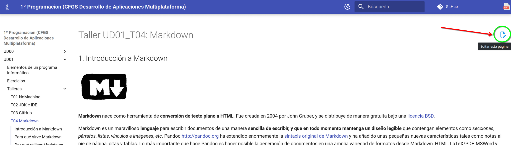
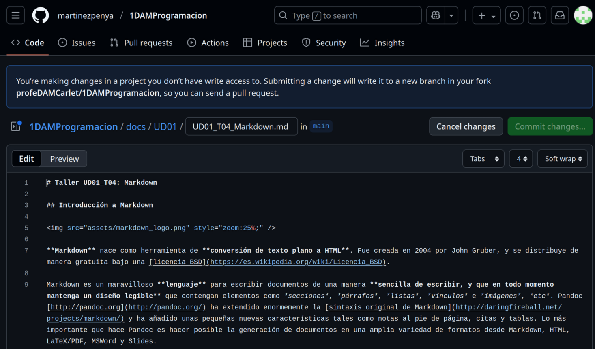
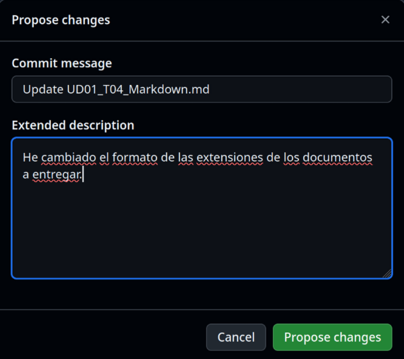
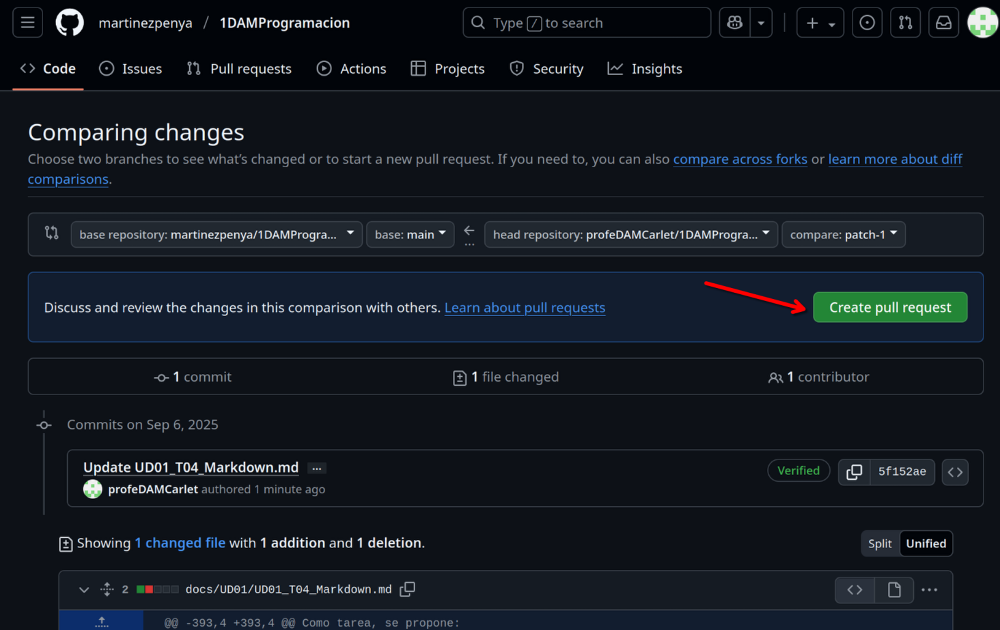
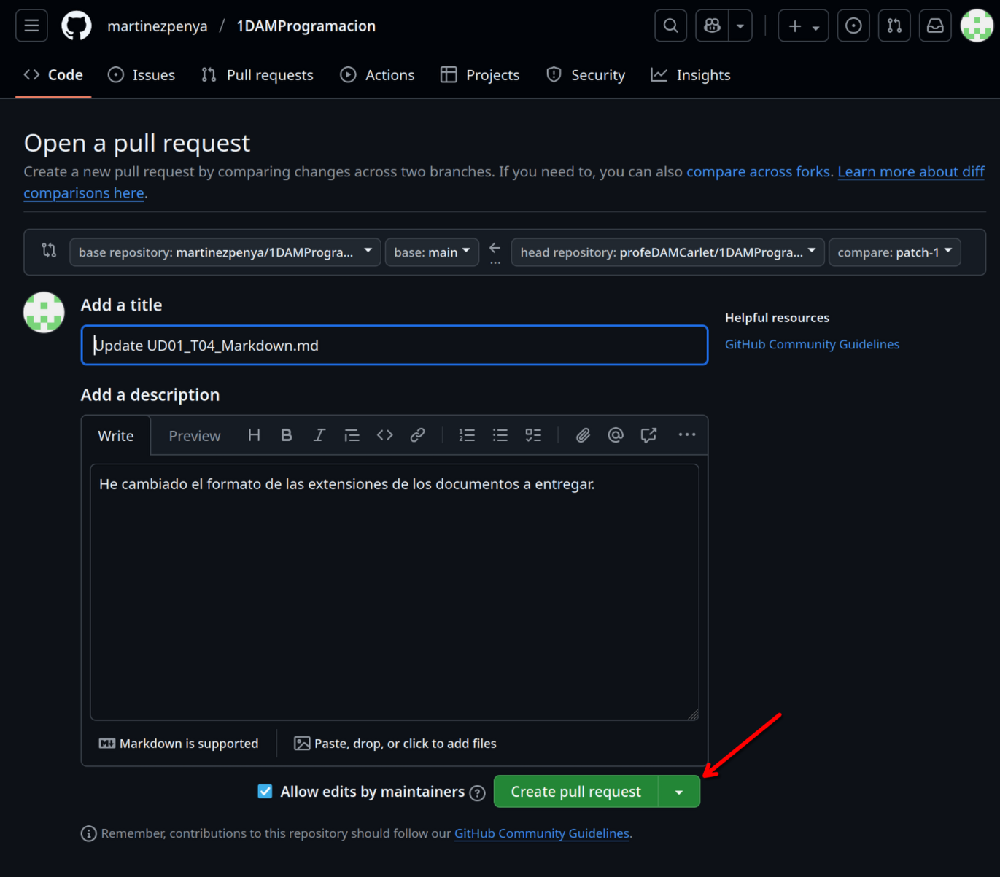
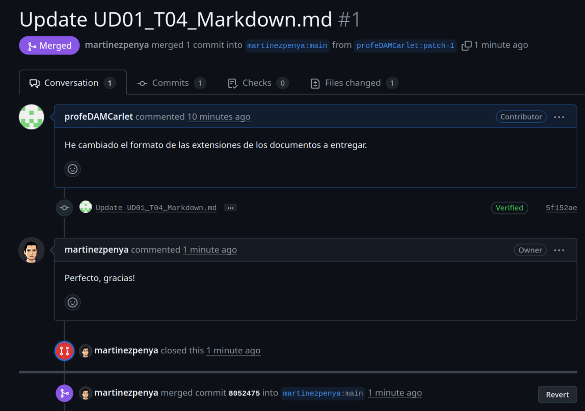

# Taller UD01_03: Crear cuenta en GitHub

## Qué es GitHub

GitHub es una plataforma en la nube basada en Git que permite a los desarrolladores almacenar, gestionar y colaborar en proyectos de código. Es el portafolio universal de los programadores.

Crear una cuenta es esencial para quien aprende o busca trabajar en programación porque: sirve como tu currículum técnico, donde muestras tus proyectos y evolución; te permite colaborar en proyectos open source para ganar experiencia real; y es una herramienta fundamental para el control de versiones y trabajo en equipo, usada por prácticamente todas las empresas tech.

## Crea tu cuenta

Accede a la plataforma GitHub: https://github.com/

Pulsa sobre el botón [Sign Up] y sigue las instrucciones para crear tu cuenta.

Una vez creada tu cuenta, entra en tu página principal, por ejemplo la mia es esta: https://github.com/martinezpenya (`martinezpenya` es mi usuario de github) y realiza una captura de pantalla.

## Solicitar corrección de los apuntes

Ahora, para probar nuestra nueva cuenta y colaborar con algún proyecto, no hay nada mejor que ayudar a mejorar los apuntes del profesor de Programación :smiley: 😄:.

Accedemos a la página de los apuntes en la que hemos detectado el error o queremos sugerir un cambio y en la parte superior derecha debe aparecer el icono:

Esto nos llevará a crear un Fork del repositorio (este concepto lo aprenderás más adelante en el módulo de Entornos de Desarrollo):

Ahora debemos pulsar el botón **[Fork this repository]**, y a continuación veremos el código de la página en nuestro fork que es `MarkDown` (Puedes aprender más sobre `MarkDown` en el Taller 4):

Ahora debemos buscar el texto a modificar y una vez hayamos cambiado algo del documento se activará el botón [Commit changes...]:

Ahora debes explicar cual ha sido la modificación que hemos realizado y pulsar el botón [Propose changes]:

Todavía no hemos terminado! ahora hay que comunciar los cambios propuestos en nuestro Fork al propietario del repositorio, para que los visualice y valore si los quiere incluir en la página de documentación. Para ello debemos pulsar el botón [Create pull request]:

Ahora podemos modificar el mensaje (pero no hace falta), directamente pulsamos sobre el botón [Create pull request]:

Ahora si, deberías ver una página similar a la siguiente, de la que también deberás obtener una captura y adjuntarla al `.pdf`, y además explicar los 4 campos que hay redondeados:

Como resumen:

1. Hemos creado un fork de un repositorio.
2. Hemos modificado un archivo en nuestro fork.
3. Hemos comparado nuestro fork con el original y hemos creado un pull request con las diferencias.

Ahora pueden pasar dos cosas, que el propietario del repositorio original acepte nuestros cambios, y por tanto pasaremos a ser colaboradores del repositorio original.

O bien, que el cambio no sea aceptado.

En cualquiera de los dos casos, si adjuntas las capturas y explicas los campos la actividad estará correcta.

En este caso concreto se ha aceptado la modificación:

## Tarea

- Crea un documento `.pdf` donde debes adjuntar la captura de tu perfil de github.

- Añade una **captura** de pantalla donde se vea que has solicitado el **pull request** y que estás esperando a que se integre en el repositorio original. 

- Además, **explica** que significan cada uno de los **4 apartados** señalados en la captura.

**Adjunta el documento `.pdf` con las capturas y las explicaciones a la tarea de AULES.**
