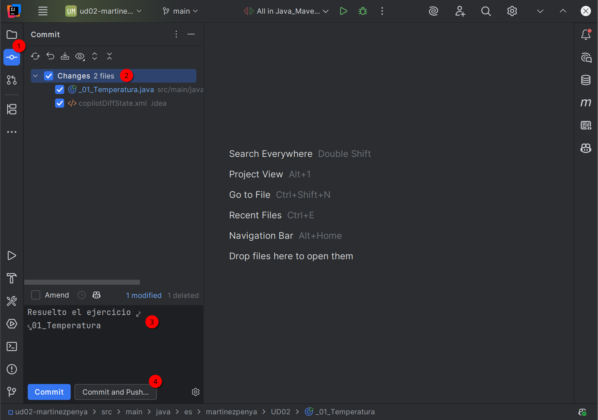

# Taller UD02_01: GitHub Classroom

## Requisitos previos

Necesitamos:

- Una cuenta de GitHub
- Tener el IDE IntelliJ instalado en nuestro ordenador

## Unirnos a GitHub Classroom

Aceptamos el *Assignement* (la tarea/ejercicio) a partir del link del profesor, en este caso: https://classroom.github.com/a/LTEIJf5H


Nos mostrará la siguiente pantalla:


Abrimos el enlace que aparece con fondo azul: [https://github.com/IES-Eduardo-Primo-Marques/ud02-martinezpenya](https://github.com/IES-Eduardo-Primo-Marques/ud02-martinezpenya) (Vuestro enlace será diferente, este es el mio)

Esto nos lleva al repositorio en GitHub, y desde allí, copiamos la URL del repositorio, pero la de `ssh` en lugar de `https`:


## Preparar nuestra autenticación a GitHub mediante clave privada/pública (necesaria para usar ssh)

En agosto 2021 GitHub eliminó la autenticación por contraseña para operaciones Git en la línea de comandos. Desde el 13 de agosto de 2021, es OBLIGATORIO usar:

- Tokens de acceso personal (Personal Access Tokens - PAT) para HTTPS
- Claves SSH para conexiones SSH
- GitHub CLI con su propio sistema de autenticación

### Paso 1: Generar una nueva clave SSH

1. **Abre la consola** o PowerShell

2. **Genera la clave SSH**:
    ```
    ssh-keygen -t ed25519 -C "tu_email@ejemplo.com"
    ```
    Reemplaza `"tu_email@ejemplo.com"` con tu email de GitHub

    Para sistemas más antiguos, usa: `ssh-keygen -t rsa -b 4096 -C "tu_email@ejemplo.com"`

3. **Sigue las instrucciones**:
    ```
    Enter file in which to save the key (C:\Users\tunombre/.ssh/id_ed25519):
    ```

​	Presiona **Enter** para aceptar la ubicación por defecto

4. **Establece una contraseña segura** (opcional pero recomendado):
    ```
    Enter passphrase (empty for no passphrase):
    Enter same passphrase again:
    ```

5. Introduce una **contraseña segura** y confírmala.

###  Paso 2: Localizar y copiar la clave pública

1. Navega al directorio `.ssh`:
   Deberías ver `id_ed25519` (clave privada) y `id_ed25519.pub` (clave pública)

2. Copia la clave pública `id_ed25519.pub`:

   Abre el archivo en el Bloc de notas y copia el contenido del fichero

### Paso 3: Iniciar el agente y agregar la clave privada

1. Abre PowerShell (esta vez necesitaras hacerlo como Administrador)

2. **Verifica si el servicio SSH está instalado**:

   ```powershell
   Get-WindowsCapability -Online | Where-Object Name -like 'OpenSSH*'
   ```

3. Si falta algún componente, **instálalo**:

   ```powershell
   #Instalar cliente SSH
   Add-WindowsCapability -Online -Name OpenSSH.Client~~~~0.0.1.0
   #Instalar servidor SSH (opcional)
   Add-WindowsCapability -Online -Name OpenSSH.Server~~~~0.0.1.0
   ```

4. **Inicia el agente SSH**:

   ```powershell
   # Iniciar servicio
   Start-Service ssh-agent
   
   # Configurar para inicio automático
   Set-Service -Name ssh-agent -StartupType Automatic
   ```

5. **Agrega tu clave SSH**:

   ```powershell
   ssh-add $env:USERPROFILE\.ssh\id_ed25519
   ```

### Paso 4: Configurar la clave SSH en GitHub

1. **Inicia sesión en tu cuenta de GitHub**
   - Ve a [github.com](https://github.com) y accede a tu cuenta
2. **Accede a la configuración de SSH**:
   - Haz clic en tu **foto de perfil** (esquina superior derecha)
   - Selecciona **Settings**
   - En el menú lateral, haz clic en **SSH and GPG keys**
3. **Agrega una nueva clave SSH**:
   - Haz clic en el botón **New SSH key** o **Add SSH key**
4. **Completa los campos**:
   - **Title**: Un nombre descriptivo (ej: "Mi PC Windows")
   - **Key type**: Dejar como "Authentication Key"
   - **Key**: Pega la clave pública que copiaste anteriormente
5. **Guarda la clave**:
   - Haz clic en **Add SSH key**
   - Confirma tu contraseña de GitHub si es necesario

### Paso 5: Verificar la conexión SSH

1. **Prueba la conexión** en la terminal o PowerShell:

    Si ejecutas este comando:
    
    ```powershell
    ssh -T git@github.com
    ```

    Deberías ver algo parecido a esto (después de contestar `yes` a la pregunta, fíjate que aparece tu nombre de GitHub, en mi caso `martinezpenya`):

    ```powershell
    The authenticity of host 'github.com (140.82.121.3)' can't be established.
    ED25519 key fingerprint is SHA256:+DiY3wvvV6TuJJhbpZisF/zLDA0zPMSvHdkr4UvCOqU.
    This key is not known by any other names.
    Are you sure you want to continue connecting (yes/no/[fingerprint])?yes
    Warning: Permanently added 'github.com' (ED25519) to the list of known hosts.
    Hi martinezpenya! You've successfully authenticated, but GitHub does not provide shell access.
    ```
## Crear el proyecto en IntelliJ

Ahora abriremos IntelliJ y crearemos un nuevo proyecto (New Project from Version Control, o Project/Clone Repository) a partir de la url que hemos copiado en el punto anterior:


1. Pegamos la URL del paso anterior
2. Elegimos la ubicación de nuestro PC donde guardaremos el proyecto
3. Pulsamos el botón clonar

A continuación nos pedirá hacer Login con nuestra cuenta de GitHub:


Y en nuestro navegador debemos Autorizar la vinculación de GitHub en el IDE de JetBrains:


Y cuando todo esté correcto aparecerá:


Y ahora en nuestro IDE IntelliJ tenemos:


Ahora en la carpeta `src` debemos buscar el enunciado del ejercicio, en este caso `src/main/java/es/martinezpenya/UD02/_01_Temperatura.java`

```java
package es.martinezpenya.UD02;

import java.util.Scanner;

/**
 *
 * @author David Martínez (https://wwww.martinezpenya.es | https://martinezpenya.es/1DAMProgramacion/)
 */

/*
ENUNCIADO (Puntos: 2)
    (Temperatura) Crear una clase llamada Temperatura con dos métodos:

   - `celsiusToFarenheit`. Convierte grados *Celsius* a *Farenheit*.
        $$
            F=(1,8*C)+32
        $$

   - `farenheitToCelsius`. Convierte grados *Farenheit* a *Celsius*.
        $$
            C=\frac{F-32}{1,8}
        $$

*/

public class _01_Temperatura {
/* TODO: Tu solucion aqui */
}
```

Debemos leer el enunciado y escribir nuestro código donde pone:

```java
...
/* TODO: Tu solucion aqui */
...
```

Una vez comprobamos que el código funciona correctamente, vamos a comprobar si pasará los test impuestos por el profesor.

!!! warning "Importante"
    En las siguientes capturas se asume que hemos resuelto correctamente el primer ejercicio, por tanto pasamos 2 de los 69 tests que contiene la UD02.

## Comprobar los tests (Maven)

Debemos realizar dos acciones:

1. Primero compilar el proyecto completo con Maven:

   

   Una vez comprobado que aparece **BUIL SUCCESS** (seguimos).

2. Lanzar la tarea test y comprobar que sea correcta:

   

O mejor todavia, podemos ejecutar todos los test con información más visual:

1. Buscamos la carpeta `test` en el proyecto
2. Pulsamos el botón derecho del ratón sobre la carpeta `java`
3. Elegimos la opción "`Run 'All Tests'`"


Y deberíamos ver un apartado similar en la parte inferior izquierda de nuestro IDE:


Debes tener en cuenta que:

  1. Los tests no se ordenan alfabéticamente.
  2. Si aparece un circulo amarillo con una X dentro, el test no pasa (aunque alguno de los tests internos funcionen)
  3. Si el tick aparece en verde es que el test ha pasado.
  4. Solo se conceden puntos en GitHub Classroom si todos los test de la clase funcionan. En este caso solo la clase `_01_Temperatura` nos otorgará puntos

## Subir nuestra solución a GitHub Classroom

Una vez comprobado que pasamos los tests lo que queda es subir nuestra solución a GitHub Classroom para que sea evaluada y valorada por el docente (Podemos repetir el proceso tantas veces como queramos, así que lo podemos ir haciendo segun vayamos realizando los ejercicios).



1. Pasamos al apartado de control de versiones
2. Elegimos los archivos que hemos cambiado y que queremos subir al repositorio para ser evaluados
3. Indicamos el mensaje del commit (recomiendo que los puedas identificar de alguna manera, indicando lo que has cambiado, un número de versión, etc.)
4. Finalmente pulsamos el botón `Commit adn Push`

> Si aparece este error:
>
> 
>
> Podemos elegir la opción `Commit anyway and push` si hemos pasado alguno de los test correctamente, o bien `Review code analysis` para ver porque IntelliJ ha detectado algun problema.

Por último aparece esta pantalla, y pulsamos directamente el botón `Push`:


También podemos ver que test hemos pasado satisfactoriamente en nuestro repositorio de Github:


Por último, cuando el docente evalue nuestra solución y si todo ha ido bien acabaremos viendo en GitHub Classroom que nuestra solución ha pasado los tests y nos ha asignado una puntuación:

Primero aparecerá como enviado (submitted):


Y cuando esté evaluado tendrá puntuación, en este caso 1 punto de un total de 1:


## OJO: No está permitido modificar archivos del proyecto que no estén en la carpeta `src/java`

Aunque aparentemente todo te funcionará el docente será notificado e invalidará los resultados de los test:


## Tarea

Debes enviar tus soluciones a GitHub Classroom y superar al menos la mitad de los tests, cuantos más tests superados, mejor nota tendrás en la tarea.

