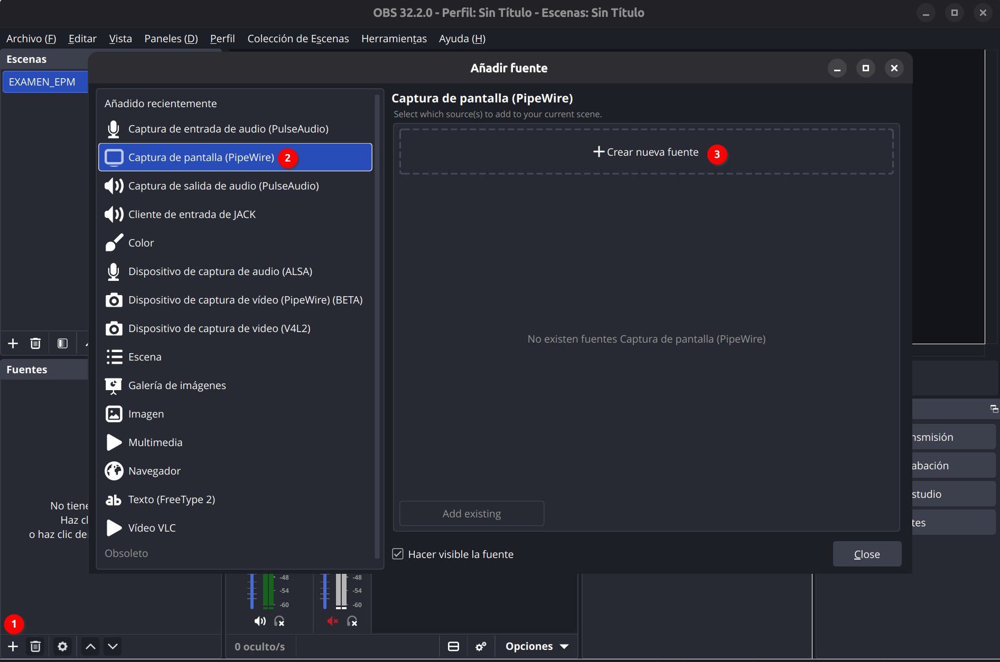
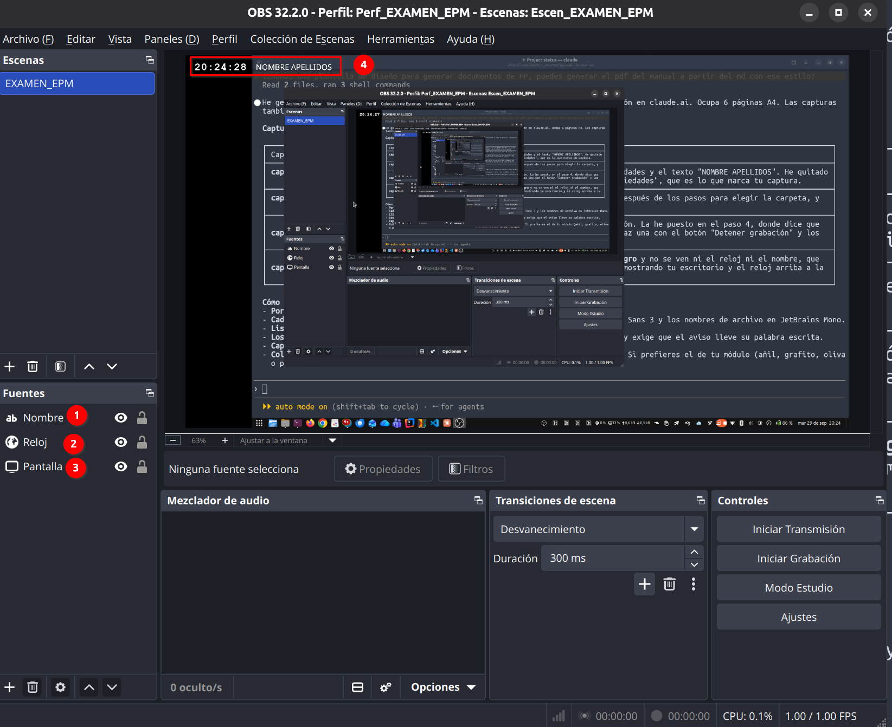
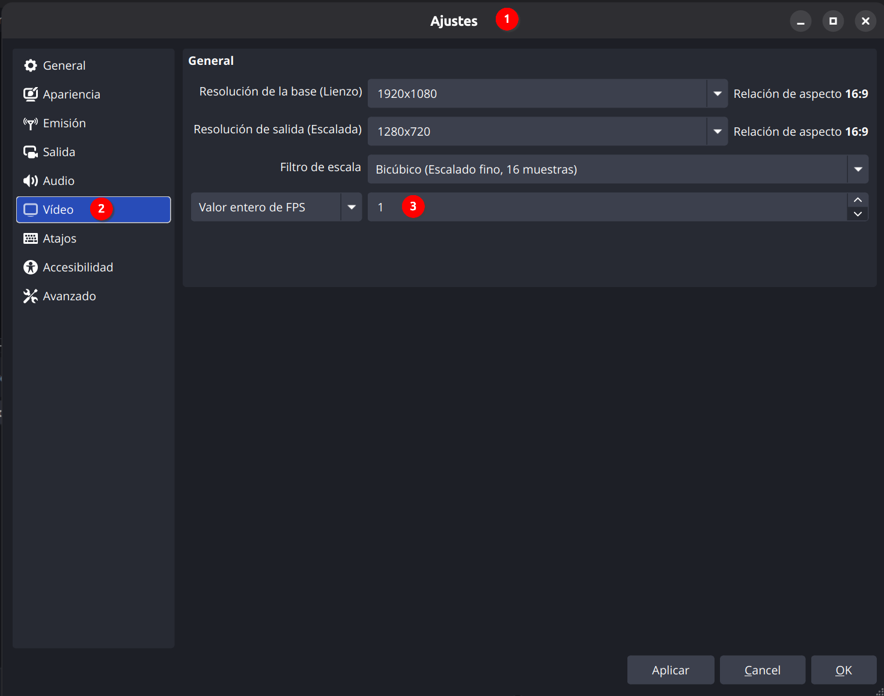

# Taller UD02_02: Configurar OBS para grabar los exámenes

## ¿Por qué grabamos los exámenes?

En los exámenes prácticos del módulo grabarás tu pantalla mientras trabajas. La grabación muestra en todo momento **la hora del sistema (con segundos) y tu nombre**, y sirve para comprobar quién ha hecho el examen, cuándo y cómo.

Para grabar usaremos [OBS Studio](https://obsproject.com/es), un programa **libre, gratuito y de código abierto** que funciona en **Linux, Windows y macOS**. Tu profesor te da una plantilla ya configurada: solo tienes que importarla, escribir tu nombre y elegir dónde se guarda el vídeo.

Este taller sirve para dejarlo todo listo **antes** del primer examen y comprobar que funciona en tu portátil.

## Antes de empezar

Necesitas:

- **OBS Studio** instalado. Si no lo tienes, descárgalo gratis desde [obsproject.com](https://obsproject.com/es/download).
- La plantilla [`EXAMEN_OBS.zip`]({{ site_url }}/UD02/downloads/EXAMEN_OBS.zip){: download="EXAMEN_OBS.zip" }.

**Descomprime el zip** antes de continuar (clic derecho → *Extraer todo* en Windows, doble clic en macOS). Tendrás una carpeta con:

- `Escen_EXAMEN_EPM.json` → la colección de escenas (reloj y nombre)
- `Perf_EXAMEN_EPM` → la carpeta del perfil (ajustes de grabación)

!!! warning "Atención"
    No intentes importar directamente desde dentro del zip sin descomprimirlo: OBS no lo encontrará.

## Paso 1: Instalar OBS e importar la plantilla

1. Instala OBS Studio si no lo tienes.
2. Abre OBS.
3. Importa el perfil: menú **Perfil → Importar** y selecciona la carpeta **`Perf_EXAMEN_EPM`**. Después, abre otra vez el menú **Perfil** y haz clic en **Perf_EXAMEN_EPM** para activarlo (importar no lo activa).
4. Importa la colección de escenas: menú **Colección de escenas → Importar**, pulsa el botón **…** para buscar el archivo **`Escen_EXAMEN_EPM.json`** y acepta. Después, abre otra vez el menú **Colección de escenas** y haz clic en **Escen_EXAMEN_EPM** para activarla.

La plantilla trae una fuente llamada **"Pantalla"** preparada para Linux. Si usas **Windows o macOS** (o Linux sin Wayland), al activar la colección aparecerá un aviso de que falta esa fuente. Es normal: se soluciona así.

1. Cierra el aviso.
2. En el panel **Fuentes**, selecciona **"Pantalla"** y bórrala con el botón de la papelera.
3. Pulsa el botón **+** y elige la captura de pantalla completa de tu sistema:

- Windows → **Captura de pantalla**
- macOS → **Captura de pantalla de macOS**
- Linux con Wayland → **Captura de pantalla (PipeWire)** (ya viene en la plantilla; OBS te pedirá elegir qué pantalla compartir)
- Linux con X11 → **Captura de pantalla (XSHM)**

4. Llámala **"Pantalla"** y acepta.
5. Asegúrate de que queda **la última** de la lista de fuentes, debajo de "Nombre" y "Reloj". Si queda arriba, tapará el nombre y el reloj: arrástrala hacia abajo o usa la flecha ↓.

## Paso 2: Comprobar que el reloj aparece

La plantilla ya incluye una fuente de tipo **Navegador** llamada **"Reloj"**, con el reloj ya integrado (no necesitas ningún archivo aparte ni conexión a internet). No tienes que crearla ni tocarla, solo comprobar que aparece en la esquina de la pantalla en la vista previa:

Si no la ves, comprueba que el ojo junto a la fuente "Reloj" en el panel **Fuentes** está activado. Si aun así no aparece, avisa a tu profesor.

## Paso 3: Escribir tu nombre

1. En el panel **Fuentes**, busca la fuente de texto llamada **"Nombre"**.
2. Haz doble clic sobre ella (o selecciónala y pulsa **Propiedades**).
3. Borra el texto de ejemplo **"NOMBRE APELLIDOS"**.
4. Escribe tu nombre y apellidos reales.
5. Cierra la ventana de propiedades.

!!! warning "Atención"
    La fuente debe ser de tipo **Texto (FreeType 2)**. Si por error creas una nueva y tu sistema te ofrece **Texto (GDI+)**, no la uses: esa variante solo existe en Windows y en Mac/Linux no aparecerá.

## Paso 4: Elegir dónde se guarda el vídeo

La resolución, los FPS (1) y el formato de grabación (MP4) ya vienen preconfigurados en el perfil que has importado. No cambies nada en **Ajustes → Vídeo**.

Lo único que debes revisar es la carpeta donde se guardará la grabación:

1. Abre **Ajustes → Salida** y ve a la pestaña **Grabación**.
2. En **Ruta de grabación**, pulsa **Examinar** y elige tu carpeta **Vídeos**.
3. Pulsa **OK**. No toques ningún otro ajuste de esa pantalla.

## Paso 5: Grabar

1. Comprueba en la vista previa de OBS que se ven **tu nombre** y **el reloj con los segundos** en la esquina de la pantalla.
2. Pulsa **Iniciar grabación**.
3. Trabaja con normalidad.
4. Al terminar, pulsa **Detener grabación**.
5. El vídeo queda en la carpeta que elegiste en el paso 4, con la fecha y la hora en el nombre del archivo.

!!! info "Grabaciones largas"
    Si la grabación es muy larga, OBS la divide automáticamente en varios archivos (cada uno de unos 250 MB, lo que equivale a más de 3 horas de grabación). En ese caso tendrás varios vídeos con la fecha y hora en el nombre: en un examen **hay que entregarlos todos**, no solo el último.

## Resumen

!!! info "Resumen"
    Importas y **activas** el perfil `Perf_EXAMEN_EPM` y la colección `Escen_EXAMEN_EPM`, cambias la fuente "Pantalla" por la de tu sistema si hace falta (siempre la última de la lista), escribes tu nombre en la fuente "Nombre" y eliges la carpeta de grabación. El resto ya viene configurado.

## Tarea

Como tarea, se propone:

- Dejar OBS configurado en tu portátil siguiendo los pasos de este taller.
- Hacer una grabación corta de tu pantalla, de **al menos 10 segundos**.
- En el vídeo se debe ver en todo momento **el reloj con los segundos avanzando** y **tu nombre y apellidos** (no el texto de ejemplo "NOMBRE APELLIDOS").
- Comprobar que el vídeo se reproduce correctamente antes de entregarlo.
- **Subir a la plataforma *<u>AULES</u>* el archivo de vídeo (*.mp4) generado por OBS.**
