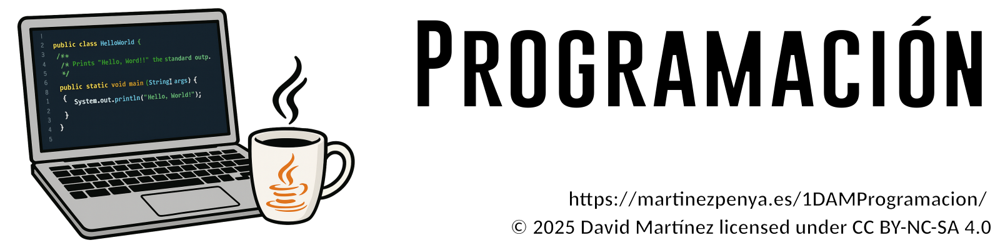

# 🚀 Información importante

## 📛 Denominación del curso

**📚 Ciclo formativo de Grado Superior en Desarrollo de Aplicaciones Multiplataforma**

☕ Programación (PRG)

| **B5** | UD05: Desarrollo de clases               | 25   |
| ------ | ---------------------------------------- | ---- |
| **B6** | UD06: Lectura y escritura de información | 25   |
| **B4** | UD07: Colecciones y Funciones Lambda     |      |

## 📋 Contenidos

|            |                                                            | **Horas** |
| ---------- | :--------------------------------------------------------- | --------: |
| **Bloque** | **P R I M E R**   TRIMESTRE                                |    **89** |
| **B1**     | UD01: Elementos de un programa informático                 |        19 |
| **B2**     | UD02: Utilización de Objetos                               |        20 |
|            | **PRUEBA UNIDADES 1 Y 2**                                  |     **6** |
| **B3**     | UD03: Estructuras de control y Excepciones                 |        20 |
| **B4**     | UD04: Estructuras de datos Arrays y matrices. Recursividad |        18 |
|            | **1**^a^ **EVALUACIÓN**                                    |     **6** |
|            | **S E G U N D O**   TRIMESTRE                              |    **77** |
| **B5**     | UD05: Desarrollo de clases                                 |        25 |
| **B6**     | UD06: Lectura y escritura de información                   |        25 |
| **B4**     | UD07: Colecciones y Funciones Lambda                       |        21 |
|            | **2^a^ EVALUACIÓN**                                        |     **6** |
|            | **T E R C E R**   TRIMESTRE                                |    **90** |
| **B8**     | UD08: Composición, Herencia y Polimorfismo                 |        20 |
| **B9**     | UD09: Creación de interfaces gráficas                      |        20 |
| **B10**    | UD10: Acceso a Bases de datos                              |        24 |
| **B11**    | UD11: BBDD OO                                              |        16 |
|            | **3^a^ EVALUACIÓN**                                        |     **6** |
|            | **CONVOCATÒRIA ORDINÀRIA**                                 |     **4** |
|            | **T O T A L**                                              |   **256** |

## 🎯 Resultados de Aprendizaje (RA)
|         | **Descripció**                                               | **Pes** | **UNITAT** | **Avaluació**                                                |
| ------: | ------------------------------------------------------------ | ------: | ---------: | ------------------------------------------------------------ |
| **RA1** | **Reconoce la estructura de un programa informático, identificando y relacionando los elementos propios del lenguaje de programación utilizado.** | **10%** |            |                                                              |
|       A | Se han identificado los bloques que componen la estructura de un programa informático. |     11% |          1 | =[[1AVA]]                                                    |
|       B | Se han creado proyectos de desarrollo de aplicaciones        |     11% |          2 | =[[1AVA]]                                                    |
|       C | Se han utilizado entornos integrados de desarrollo.          |     11% |          2 | =([[1AVA]]\*0,5)+([[FEE]]\*0,5)                              |
|       D | Se han identificado los distintos tipos de variables y la utilidad específica de cada uno. |     11% |          1 | =([[1AVA]]\*0,2)+([[2AVA]]\*0,3)+([[3AVA]]\*0,5)             |
|       E | Se ha modificado el código de un programa para crear y utilizar variables. |     11% |          1 | =([[1AVA]]*0,2)+([[2AVA]]*0,3)+([[3AVA]]*0,5)                |
|       F | Se han creado y utilizado constantes y literales.            |     11% |          1 | =([[1AVA]]*0,2)+([[2AVA]]*0,3)+([[3AVA]]*0,5)                |
|       G | Se han clasificado, reconocido y utilizado en expresiones los operadores del lenguaje. |     11% |          1 | =([[1AVA]]*0,2)+([[2AVA]]*0,3)+([[3AVA]]*0,5)                |
|       H | Se ha comprobado el funcionamiento de las conversiones de tipo explícitas e implícitas. |     11% |          1 | =([[1AVA]]*0,2)+([[2AVA]]*0,3)+([[3AVA]]*0,5)                |
|       I | Se han introducido comentarios en el código.                 |     11% |          1 | =([[1AVA]]*0,2)+([[2AVA]]*0,3)+([[3AVA]]*0,5)                |
|         | **Descripció**                                               | **Pes** | **UNITAT** | **Avaluació**                                                |
| **RA2** | **Escribe y prueba programas sencillos, reconociendo y aplicando los fundamentos de la programación orientada a objetos.** | **10%** |            |                                                              |
|       A | Se han identificado los fundamentos de la programación orientada a objetos. |     11% |          2 | =[[1AVA]]                                                    |
|       B | Se han escrito programas simples.                            |     11% |          2 | =([[1AVA]]*0,2)+([[2AVA]]*0,3)+([[3AVA]]*0,5)                |
|       C | Se han instanciado objetos a partir de clases predefinidas.  |     11% |          2 | =([[1AVA]]*0,2)+([[2AVA]]*0,3)+([[3AVA]]*0,5)                |
|       D | Se han utilizado métodos y propiedades de los objetos.       |     11% |          2 | =([[1AVA]]*0,2)+([[2AVA]]*0,3)+([[3AVA]]*0,5)                |
|       E | Se han escrito llamadas a métodos estáticos.                 |     11% |          2 | =([[1AVA]]*0,2)+([[2AVA]]*0,3)+([[3AVA]]*0,5)                |
|       F | Se han utilizado parámetros en la llamada a métodos.         |     11% |          2 | =([[1AVA]]*0,2)+([[2AVA]]*0,3)+([[3AVA]]*0,5)                |
|       G | Se han incorporado y utilizado librerías de objetos.         |     11% |          2 | =([[1AVA]]*0,2)+([[2AVA]]*0,3)+([[3AVA]]*0,5)                |
|       H | Se han utilizado constructores.                              |     11% |          2 | =([[1AVA]]*0,2)+([[2AVA]]*0,3)+([[3AVA]]*0,5)                |
|       I | Se ha utilizado el entorno integrado de desarrollo en la creación y compilación de programas simples. |     11% |          2 | =([[1AVA]]*0,05)+([[2AVA]]*0,15)+([[3AVA]]*0,30)+([[FEE]]*0,50) |
|         | **Descripció**                                               | **Pes** | **UNITAT** | **Avaluació**                                                |
| **RA3** | **Escribe y depura código, analizando y utilizando las estructuras de control del lenguaje.** | **10%** |            |                                                              |
|       A | Se ha escrito y probado código que haga uso de estructuras de selección. |     11% |          3 | =([[1AVA]]*0,2)+([[2AVA]]*0,3)+([[3AVA]]*0,5)                |
|       B | Se han utilizado estructuras de repetición.                  |     11% |          3 | =([[1AVA]]*0,2)+([[2AVA]]*0,3)+([[3AVA]]*0,5)                |
|       C | Se han reconocido las posibilidades de las sentencias de salto. |     11% |          3 | =([[1AVA]]*0,2)+([[2AVA]]*0,3)+([[3AVA]]*0,5)                |
|       D | Se ha escrito código utilizando control de excepciones.      |     11% |          3 | =([[1AVA]]*0,2)+([[2AVA]]*0,3)+([[3AVA]]*0,5)                |
|       E | Se han creado programas ejecutables utilizando diferentes estructuras de control. |     11% |          3 | =([[1AVA]]*0,2)+([[2AVA]]*0,3)+([[3AVA]]*0,5)                |
|       F | Se han probado y depurado los programas.                     |     11% |          3 | =([[1AVA]]*0,2)+([[2AVA]]*0,3)+([[3AVA]]*0,5)                |
|       G | Se ha comentado y documentado el código.                     |     11% |          3 | =([[1AVA]]*0,05)+([[2AVA]]*0,15)+([[3AVA]]*0,30)+([[FEE]]*0,50) |
|   **H** | **Se han creado excepciones.**                               |     11% |          3 | =([[1AVA]]*0,2)+([[2AVA]]*0,3)+([[3AVA]]*0,5)                |
|   **I** | **Se han utilizado aserciones para la detección y corrección de errores durante la fase de desarrollo.** |     11% |          3 | =([[1AVA]]*0,2)+([[2AVA]]*0,3)+([[3AVA]]*0,5)                |
|         | **Descripció**                                               | **Pes** | **UNITAT** | **Avaluació**                                                |
| **RA4** | **Desarrolla programas organizados en clases analizando y aplicando los principios de la programación orientada a objetos.** | **10%** |            |                                                              |
|       A | Se ha reconocido la sintaxis, estructura y componentes típicos de una clase. |     11% |          5 | =([[2AVA]]*0,5)+([[3AVA]]*0,5)                               |
|       B | Se han definido clases.                                      |     11% |          5 | =([[2AVA]]*0,5)+([[3AVA]]*0,5)                               |
|       C | Se han definido propiedades y métodos.                       |     11% |          5 | =([[2AVA]]*0,5)+([[3AVA]]*0,5)                               |
|       D | Se han creado constructores.                                 |     11% |          5 | =([[2AVA]]*0,5)+([[3AVA]]*0,5)                               |
|       E | Se han desarrollado programas que instancien y utilicen objetos de las clases creadas anteriormente. |     11% |          5 | =([[2AVA]]*0,5)+([[3AVA]]*0,5)                               |
|       F | Se han utilizado mecanismos para controlar la visibilidad de las clases y de sus miembros. |     11% |          5 | =([[2AVA]]*0,5)+([[3AVA]]*0,5)                               |
|       G | Se han definido y utilizado clases heredadas.                |     11% |          5 | =([[2AVA]]*0,5)+([[3AVA]]*0,5)                               |
|       H | Se han creado y utilizado métodos estáticos.                 |     11% |          5 | =([[2AVA]]*0,5)+([[3AVA]]*0,5)                               |
|       I | Se han creado y utilizado conjuntos y librerías de clases.   |     11% |          5 | =([[2AVA]]*0,5)+([[3AVA]]*0,5)                               |
|         | **Descripció**                                               | **Pes** | **UNITAT** | **Avaluació**                                                |
| **RA5** | **Realiza operaciones de entrada y salida de información, utilizando procedimientos específicos del lenguaje y librerías de clases.** | **15%** |            |                                                              |
|       A | Se ha utilizado la consola para realizar operaciones de entrada y salida de información. |     10% |          6 | =([[1AVA]]*0,05)+([[2AVA]]*0,15)+([[3AVA]]*0,30)+([[FEE]]*0,50) |
|       B | Se han aplicado formatos en la visualización de la información. |     10% |          6 | =([[1AVA]]*0,2)+([[2AVA]]*0,3)+([[3AVA]]*0,5)                |
|       C | Se han reconocido las posibilidades de entrada / salida del lenguaje y las librerías asociadas. |     10% |          6 | =([[2AVA]]*0,5)+([[3AVA]]*0,5)                               |
|       D | Se han utilizado ficheros para almacenar y recuperar información. |     10% |          6 | =([[2AVA]]*0,5)+([[3AVA]]*0,5)                               |
|       E | Se han creado programas que utilicen diversos métodos de acceso al contenido de los ficheros. |     10% |          6 | =([[2AVA]]*0,5)+([[3AVA]]*0,5)                               |
|       F | Se han utilizado las herramientas del entorno de desarrollo para crear interfaces gráficos de usuario simples. |     20% |          9 | '=([[3AVA]]*0,25)+([[FEE]]*0,50)+(([[UD09_T01]]*0,25)+([[UD09_T02]]*0,25)+([[UD09_T03]]*0,5)*0,25) |
|       G | Se han programado controladores de eventos.                  |     15% |          9 | '=([[3AVA]]*0,4)+(([[UD09_T01]]*0,25)+([[UD09_T02]]*0,25)+([[UD09_T03]]*0,5)*0,6) |
|       H | Se han escrito programas que utilicen interfaces gráficos para la entrada y salida de información. |     15% |          9 | '=([[3AVA]]*0,4)+(([[UD09_T01]]*0,25)+([[UD09_T02]]*0,25)+([[UD09_T03]]*0,5)*0,6) |
|         | **Descripció**                                               | **Pes** | **UNITAT** | **Avaluació**                                                |
| **RA6** | **Escribe programas que manipulen información seleccionando y utilizando tipos avanzados de datos.** | **20%** |            |                                                              |
|       A | Se han escrito programas que utilicen **matrices (arrays).** |     50% |          4 | =([[2AVA]]*0,5)+([[3AVA]]*0,50)                              |
|       B | Se han reconocido las librerías de clases relacionadas con tipos de datos avanzados. |      5% |          7 | =[[3AVA]]                                                    |
|       C | Se han utilizado listas para almacenar y procesar información. |      5% |          7 | =[[3AVA]]                                                    |
|       D | Se han utilizado iteradores para recorrer los elementos de las listas. |      5% |          7 | =[[3AVA]]                                                    |
|       E | Se han reconocido las características y ventajas de cada una de la colecciones de datos disponibles. |     10% |          7 | =[[3AVA]]                                                    |
|       F | Se han creado clases y métodos genéricos.                    |      5% |          7 | =[[3AVA]]                                                    |
|       G | Se han utilizado expresiones regulares en la búsqueda de patrones en cadenas de texto. |      5% |          7 | =[[3AVA]]                                                    |
|   **H** | **Se han identificado las clases relacionadas con el tratamiento de documentos escritos en diferentes lenguajes de intercambio de datos.** |      5% |          7 | =([[UD08_T01]]*0,5)+([[UD08_T02]]*0,5)                       |
|   **I** | **Se han realizado programas que realicen manipulaciones sobre documentos escritos en diferentes lenguajes de intercambio de datos.** |      5% |          7 | =([[UD08_T01]]*0,5)+([[UD08_T02]]*0,5)                       |
|   **J** | **Se han utilizado operaciones agregadas para el manejo de información almacenada en colecciones.** |      5% |          7 | =[[3AVA]]                                                    |
|         | **Descripció**                                               | **Pes** | **UNITAT** | **Avaluació**                                                |
| **RA7** | **Desarrolla programas aplicando características avanzadas de los lenguajes orientados a objetos y del entorno de programación.** | **10%** |            |                                                              |
|       A | Se han identificado los conceptos de herencia, superclase y subclase. |     10% |          8 | =[[3AVA]]                                                    |
|       B | Se han utilizado modificadores para bloquear y forzar la herencia de clases y métodos. |     10% |          8 | =[[3AVA]]                                                    |
|       C | Se ha reconocido la incidencia de los constructores en la herencia. |     10% |          8 | =[[3AVA]]                                                    |
|       D | Se han creado clases heredadas que sobrescriban la implementación de métodos de la superclase. |     10% |          8 | =[[3AVA]]                                                    |
|       E | Se han diseñado y aplicado jerarquías de clases.             |     10% |          8 | =[[3AVA]]                                                    |
|       F | Se han probado y depurado las jerarquías de clases.          |     10% |          8 | =[[3AVA]]                                                    |
|       G | Se han realizado programas que implementen y utilicen jerarquías de clases. |     10% |          8 | =[[3AVA]]                                                    |
|       H | Se ha comentado y documentado el código.                     |     10% |          8 | =([[3AVA]]*0,50)+([[FEE]]*0,50)                              |
|   **I** | **Se han identificado y evaluado los escenarios de uso de interfaces.** |     10% |          8 | =[[3AVA]]                                                    |
|   **J** | **Se han identificado y evaluado los escenarios de utilización de la herencia y la composición.** |     10% |          8 | =[[3AVA]]                                                    |
|         | **Descripció**                                               | **Pes** | **UNITAT** | **Avaluació**                                                |
| **RA8** | **Utiliza bases de datos orientadas a objetos, analizando sus características y aplicando técnicas para mantener la persistencia de la información.** |  **5%** |            |                                                              |
|       A | Se han identificado las características de las bases de datos orientadas a objetos. |     13% |         11 | =([[UD11_T1]]*0,3)+([[UD11_T2]]*0,7)                         |
|       B | Se ha analizado su aplicación en el desarrollo de aplicaciones mediante lenguajes orientados a objetos. |     13% |         11 | =([[UD11_T1]]*0,3)+([[UD11_T2]]*0,7)                         |
|       C | Se han instalado sistemas gestores de bases de datos orientados a objetos. |     13% |         11 | =([[UD11_T1]]*0,3)+([[UD11_T2]]*0,7)                         |
|       D | Se han clasificado y analizado los distintos métodos soportados por los sistemas gestores para la gestión de la información almacenada. |     13% |         11 | =([[UD11_T1]]*0,3)+([[UD11_T2]]*0,7)                         |
|       E | Se han creado bases de datos y las estructuras necesarias para el almacenamiento de objetos. |     13% |         11 | =([[UD11_T1]]*0,3)+([[UD11_T2]]*0,7)                         |
|       F | Se han programado aplicaciones que almacenen objetos en las bases de datos creadas. |     13% |         11 | =([[UD11_T1]]*0,3)+([[UD11_T2]]*0,7)                         |
|       G | Se han realizado programas para recuperar, actualizar y eliminar objetos de las bases de datos. |     13% |         11 | =([[UD11_T1]]*0,3)+([[UD11_T2]]*0,7)                         |
|       H | Se han realizado programas para almacenar y gestionar tipos de datos estructurados, compuestos y relacionados. |     13% |         11 | =([[UD11_T1]]*0,3)+([[UD11_T2]]*0,7)                         |
|         | **Descripció**                                               | **Pes** | **UNITAT** | **Avaluació**                                                |
| **RA9** | **Gestiona información almacenada en bases de datos relacionales manteniendo la integridad y consistencia de los datos.** | **10%** |            |                                                              |
|       A | Se han identificado las características y métodos de acceso a sistemas gestores de bases de datos relacionales. |     14% |         10 | =([[UD10_T1]]*0,2)+([[UD10_T2]]*0,3)+([[UD10_T3]]*0,5)       |
|       B | Se han programado conexiones con bases de datos.             |     14% |         10 | =([[UD10_T1]]*0,2)+([[UD10_T2]]*0,3)+([[UD10_T3]]*0,5)       |
|       C | Se ha escrito código para almacenar información en bases de datos. |     14% |         10 | =([[UD10_T1]]*0,2)+([[UD10_T2]]*0,3)+([[UD10_T3]]*0,5)       |
|       D | Se han creado programas para recuperar y mostrar información almacenada en bases de datos. |     14% |         10 | =([[UD10_T1]]*0,2)+([[UD10_T2]]*0,3)+([[UD10_T3]]*0,5)       |
|       E | Se han efectuado borrados y modificaciones sobre la información almacenada. |     14% |         10 | =([[UD10_T1]]*0,2)+([[UD10_T2]]*0,3)+([[UD10_T3]]*0,5)       |
|       F | Se han creado aplicaciones **que muestren la información almacenada en** bases de datos. |     14% |         10 | =([[UD10_T1]]*0,05)+([[UD10_T2]]*0,15)+([[UD10_T3]]*0,3)+([[FEE]]*0,5) |
|       G | Se han creado aplicaciones para gestionar la información presente en bases de datos **relacionales**. |     14% |         10 | =([[UD10_T1]]*0,05)+([[UD10_T2]]*0,15)+([[UD10_T3]]*0,3)+([[FEE]]*0,5) |

## 📜 Legislación vigente

- 📄 [~~RD 450/2010, BOE 20-05-2010~~](https://ceice.gva.es/documents/161863064/162743975/BOE-A-2010-8067.pdf/d64463e2-9595-4200-8676-79146348d8b2) (Antigua ley)
- 📄 [RD 405/2023 29-05-2023](https://www.boe.es/diario_boe/txt.php?id=BOE-A-2023-13221)
- 📄 [RD 500/2024, BOE 21-05-2024](https://www.boe.es/diario_boe/txt.php?id=BOE-A-2024-10685)
- 📄 [~~Currículum C.V.: ORDE 58/2012, de 5 de setembre (DOGV núm. 6868, 24.09.2012)~~](https://ceice.gva.es/documents/161863064/162743975/2012_8694.pdf/8683d3f9-3115-4375-97f8-2ee02573ec53) (Antiguo)
- 📄 [Propuesta de Decreto del Consell](https://ceice.gva.es/documents/388109149/391641510/Propuesta_DecretoCurris_LFP_GMGS_.pdf)
- 🕒 [~~Horario~~](https://ceice.gva.es/documents/388109149/390313601/infdamloe3h.pdf) (Antigua ley)
- 🕒 [Horario](https://ceice.gva.es/documents/388109149/390333672/ANEXO+horaris+GS+Web+val.pdf/2c5b7e1f-4d64-3378-acd4-770b94a5b881?t=1751269600046)

## 📝 Evaluación

- 🔍 La evaluación del módulo se realizará con base en los **Resultados de Aprendizaje (RA)** definidos en el currículo del ciclo formativo de Grado Superior en Desarrollo de Aplicaciones Multiplataforma. Cada RA estará asociado a **criterios de evaluación** (**CE**) que serán los que determinen el grado de adquisición de las competencias previstas para el módulo.

- 📊 La nota final del módulo se obtendrá a partir de la ponderación de los **RA**, como se mencionó anteriormente. Cada **RA** será evaluado de forma independiente, con calificaciones en una escala de 0 a 10.

- ✅ El alumno debe obtener al menos una nota de **5** en cada **RA** para aprobar el módulo.

- 🔄 Si un alumno obtiene menos de un **5** en algún RA, tendrá que recuperarlo mediante las actividades/exámenes de recuperación diseñadas específicamente para esos resultados de aprendizaje.

- 📊En programación los primeros RA’s se distribuyen entre las 3 evaluaciones, así que tener una buena nota en la primera evaluación no quiere decir que has aprobado los RA de esa evaluación.

- ❗**NUEVO SISTEMA DUAL!!** → Busca tu empresa! 120H (aproximadamente en el mes de mayo, también a partir del 2º trimestre por las mañanas)

!!! danger "⚠️ **IMPORTANTE:**"
    - ❗ Aprobar las distintas evaluaciones no garantiza aprobar el curso.
    - 📌 Puedes aprobar (y con muy buena nota) las dos evaluaciones, tener un `RA` suspendido y por tanto suspender el módulo.